# Business Objective

**Improve key lending KPIs via predictive risk modeling:**

- **Default rate reduction** – lower the proportion of loan applicants who default
- **Loan approval efficiency** – increase approvals for low-risk borrowers
- **Loss mitigation** – reduce financial losses from write-offs
- **Customer retention** – minimize rejection of good customers and reduce churn
- **Risk-adjusted revenue growth** – enable differentiated pricing for different risk tiers

*(All entities are fictional—“Alpha Lending” is a placeholder.)*

## About the application
This application is for lending money, fully automated decision, i.e the machine will do all the calculation and decide whether you are worthy with the money or not.

Some of the aggrement about the application:
- SLA approximately 3 minuites (180 second)
- Fully automated decision making
- Resilient to external latency and failures via retries and DLQ

Some of the assumptions about the external system:
- SLA as explained by the credit bureau is under 1 min. 
- Availability is >= 99%/monthly 
## Situation

Alpha Lending processes thousands of loan applications monthly. A large share of applicants have limited or no formal credit history. This creates two challenges:

- **Revenue loss**: Many low-risk customers are wrongly rejected due to insufficient information.  
- **Credit losses**: Some high-risk applicants are incorrectly approved, leading to higher default rates.  

The company has diverse data sources—application forms, bureau records, past loan performance, credit card balances, and repayment histories—but lacks a unified, data-driven solution to leverage them for accurate decision-making.

## Task

Design and implement a **machine learning solution** that predicts the probability of default for each applicant.  
The solution must directly support the business objective by:

- Reducing default rates among approved loans  
- Increasing approvals of creditworthy applicants  
- Providing interpretable outputs for decision-makers  
- Allowing integration into the existing loan approval pipeline  

## Action

### Data Science Team
- **Data integration**: Consolidate application, bureau, previous credit, and repayment datasets into a single analytical view.  
- **Feature engineering**: Derive risk indicators (e.g., debt-to-income ratios, missed payment counts, external risk scores).  
- **Model development**: Train and validate predictive models (e.g., gradient boosting) with ROC-AUC as the primary evaluation metric.  
- **Interpretability**: Provide probability scores and explanations (e.g., SHAP values) to ensure business usability.  
- **Deployment readiness**: Deliver APIs or batch scoring pipelines that can be embedded into operational systems.  

### Business Team
- **Define acceptance thresholds**: Work with DS team to set default-probability cutoffs that balance growth vs. risk.  
- **Policy alignment**: Adapt credit approval rules and pricing strategies based on model outputs.  
- **Operational integration**: Train loan officers on interpreting model results and using them in decision-making.  
- **Monitoring & feedback**: Establish KPIs to continuously track impact (default rates, approval rates, revenue changes).  

## Result

*To be determined after deployment and monitoring phase.*

# Dataset

# Repository Structure

# High-level System Architecture 

# Application Port Allocation

## Port Ranges and Purpose

### Infrastructure Services (9000-9099)
- 9000: MinIO Object Storage API
- 9001: MinIO Management Console
- 9010: PostgreSQL Main Database
- 9020: Redis Cache (if added later)
- 9030: Elasticsearch (if added later)

### Risk Assessment Services (8000-8099)
- 8000: Personal Loan Risk Service
- 8001: Mortgage Risk Service  
- 8002: Credit Card Risk Service
- 8010: Risk Model Training Service (if added later)
- 8020: Risk Model Validation Service (if added later)

### API and Web Services (7000-7099)
- 7000: Main API Gateway
- 7010: Authentication Service (if added later)
- 7020: Notification Service (if added later)

### Development and Monitoring (6000-6999)
- 6000: Application Monitoring Dashboard
- 6010: Log Aggregation Service
- 6020: Health Check Service

## Service Communication Patterns

Risk assessment services communicate internally using service names:
- risk-service-personal communicates with postgres-main:5432
- risk-service-personal communicates with minio-storage:9000
- api-gateway routes requests to risk-service-personal:8080

External access uses mapped ports:
- Client applications connect to api-gateway via localhost:7000
- Administrators access MinIO console via localhost:9001
- Database administrators connect to PostgreSQL via localhost:9010

# Guide to Install and Run Code

## Create network
We need to create network so that our services can communicate to each other
```shell
docker network create hc-network
```
The result will look like this: 
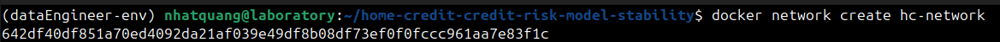

This network will be share among services, this step is **crucial** because it allow the DNS of our services to be resolve and can be reach out durring message transfer

## Run the important parts
For this, we need to spin up a few things. We will kinda assume that the company will already have this for up, including things like: 
- API services
- Data platform
- etc...

### Spin up API services and operational database
First, we need to bring up the API services and the operational database. 
```shell
docker compose --env-file ./services/core/.env.core \
    -f ./services/core/docker-compose.operationaldb.yml \
    -f ./services/core/docker-compose.api.yml \
    -f ./services/data/docker-compose.storage.yml \
    up -d
```
Just to be clear:
- API Services in this case including:
    - 1 Nginx to route customer requests.
    - 2 streamlit front-end for customer to navigate
    - 2 API services for sending and handling requests. 
- Operational database in this case including:
    - 1 file storage database (MinIO) for storing customer's documentation
    - 1 OLTP database (postgres) for storing day over day operational actions in the company. 
    - 1 PG Bouncer as a pooling layer in case there are multiple requests. 

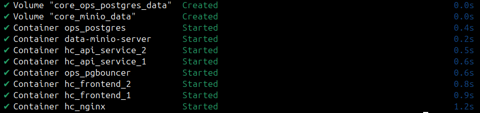

### Spin up Data Platform
There are multiple things to work here, therefore stick with me.
#### Spin up CDC and Event Bus components
In order to serve request in real-time with an event-driven manner, we will use Debezium for the change-data-capture (CDC) and Kafka. To spin these up, run the following command:
```shell
docker compose  --env-file ./services/core/.env.core \
 --env-file ./services/data/.env.data \
 -f ./services/data/docker-compose.streaming.yml \
 -f ./services/data/docker-compose.cdc.yml \
 up -d
```
This code will bring up the kafka components as well as the cdc components. 

For the CDC, there will be a helper connector that help connect Debezium to postgres using the postgres connector. 

For the Kafka, we will use zookeper for managing kafka cluster, schema registry to handle schema evolution, kafka ui from provectus labs for easier debugging process.

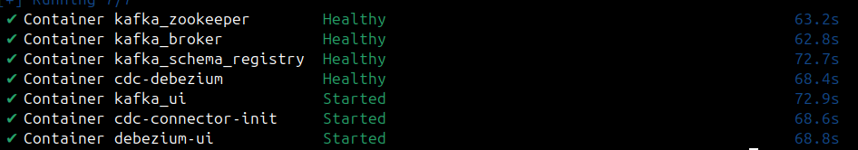

After everything is up, we need to create kafka topics, by running this following command: 

```python
python ./services/data/scripts/kafka/create_topics.py 
```

If navigate to kafka ui, we will see that there are some topics that has been created

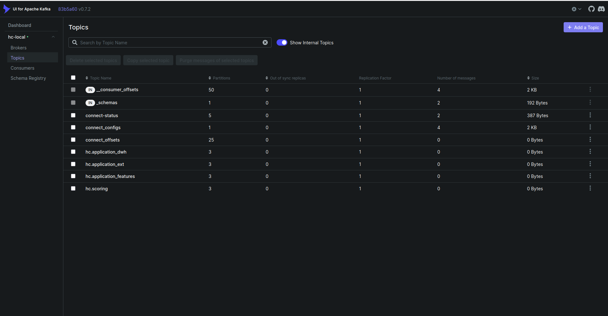

Additionally, if we check on debezium ui, we will also see that the Postgres connector is also created.

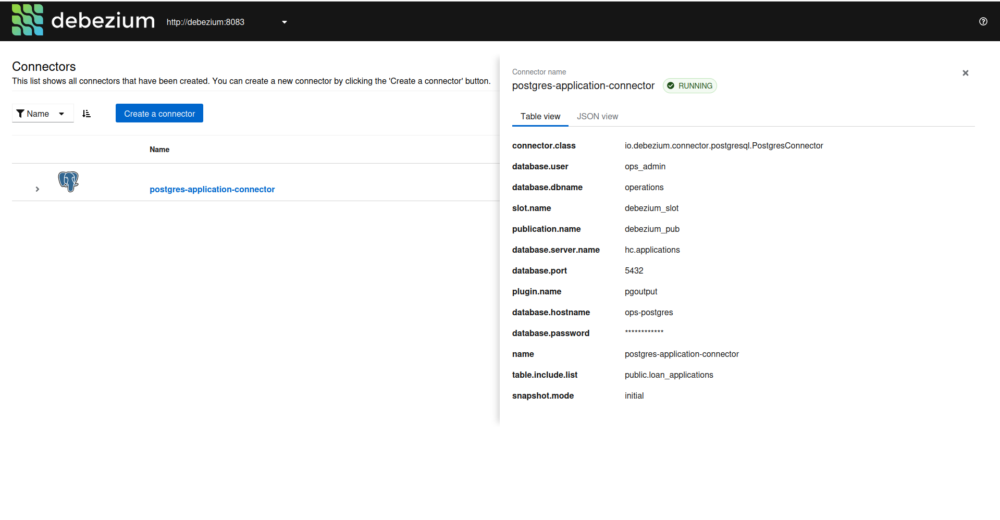

#### Spin up DWH, Data Mart and External Data.
In real life scenario, there are some data that we can not store in our datawarehouse or our operational database, because we basically dont have that kind of information and either are our customers. Therefore we need data from external sources, a dedicated third-party company that gather all the data and do some kind of transformation. And in that case, often we will need to get the data via some API being provided. 

In other to bring up the datawarehouse as well as external data, we will run: 

```shell
docker compose --env-file ./services/core/.env.core \
 --env-file ./services/data/.env.data  \
 -f ./services/data/docker-compose.warehouse.yml \ 
 up -d
```

Then, wait until all the container are started:

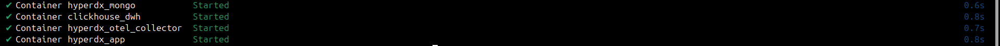

After that, we need to parse in some data. For simplicity, instead of create 2 different dwh (1 is the company's internal dwh and 1 is the bureau's external dwh), I will just merge it into 1 data warehouse with different naming convention. 

In terms of the Medallion Data Architecture, what we just bring up are called the *silver layer*. 

```shell
# For internal data
bash ./services/data/scripts/dwh/ch_load_internal.sh
# For external data
bash ./services/data/scripts/dwh/ch_load_external.sh
```

For data that are specialized and ready to use in our data mart, we will need to run dbt to perform the data transfomartion step from the *silver layer* to the *gold layer*. These transformation are applied only to our internal data warehouse because we dont have the audacity to do that with external sources.

```shell
cd ml_data_mart/
# Run the debug to see if we are missing anything
dbt debug --project-dir . --profiles-dir .
# Run the transformation
dbt run --project-dir . --profiles-dir . --target gold
```

After the transformation, it will output to be something like this:

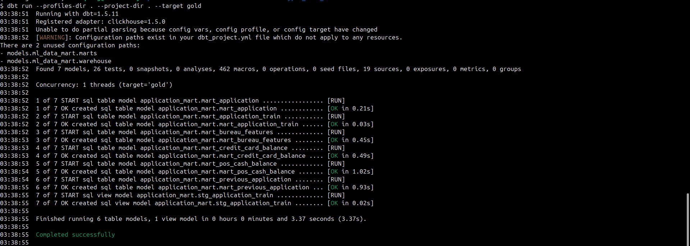

If you notice, you will see that these are under the data mart database with the prefix mart_. These will be run daily, thanks to the power of clickhouse, the transformation step will be very quick. 

After that, we also need to setup a query service. These query services will aggregate the query data that serve the modeling purpose. In some company, it's the ML Engineer that will do this step. The logic of the aggregation is taken from the ./notebooks/ folder. To bring these up, run the following: 

```shell
docker compose --env-file ./services/data/.env.data \
    -f ./services/data/docker-compose.query-services.yml \
    up -d
```

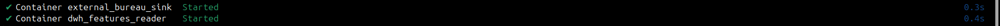

**Note**: The query services here are written in python for the aggregation, based on historical data, these aggregation are fast and lightweight, however later on when we receive more and more request, these aggregation could become our bottleneck. The solution to this is maybe written code in another language/library that is faster, could be cython or maybe sth else. 

#### Spin up Flink and submit Flink Job
We need Flink to handle the streaming processing part of the incoming data from the kafka topic. 

```shell
docker compose --env-file ./services/data/.env.data \ 
    -f services/data/docker-compose.flink.yml \
    up -d
```
For now, this stream processing flow is quite simple, it just masking the data for PII. But later on when we acquire some of the new features, we can absolutely ref back and change the logic. 

#### Spin up feature store components
For the feature stores, we will use feast. To bring feast up, run the following things:

- Start Redis (container name `feast_redis`):
  - `docker compose -f services/ml/docker-compose.feature-store.yml up -d redis`
- Apply Feast definitions (creates/updates `application/feast/data/registry.db`):
  - `rm -f application/feast/data/registry.db`
  - `docker compose -f services/ml/docker-compose.feature-store.yml run --rm feast-apply`
- Start stream materializer (Kafka → Redis):
  - `docker compose -f services/ml/docker-compose.feature-store.yml up -d feast-stream`
- Check stream logs (optional):
  - `docker logs -f feast_stream`

What feast will do now is basically consume all data produced by all of those kafka topics, unified it and store into redis for later retrieval from the scoring services.

Notes
- Redis is addressed as `feast_redis:6379` inside the network (configured in `application/feast/feature_store.yaml`).
- If you change feature views, re-run the “apply” step to update the registry.

#### Spin up model registry components
We will use mlflow for registering the model as well as postgres to store model metrics, minio for model.pkl so that we can load it later. To run this, simply run:

```shell
docker compose --env-file ./services/ml/.env.ml \
    -f ./services/ml/docker-compose.registry.yml \
    up -d
```
After running, we will see that mlflow is up and running

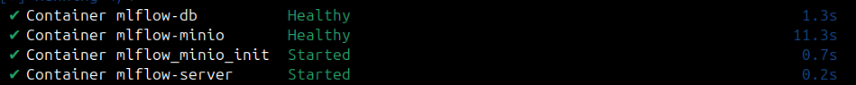

For simplicity of the demo, we will try and train a simple model first, then we will store it into mlflow's minio, and later on load it and use the scoring service with it. 

```shell
export MLFLOW_TRACKING_URI=http://localhost:5000
export MLFLOW_S3_ENDPOINT_URL=http://localhost:9006
export AWS_ACCESS_KEY_ID=minio_user
export AWS_SECRET_ACCESS_KEY=minio_password

python application/training/train_register.py \
--data data/complete_feature_dataset.csv \
--register-name credit_risk_model \
--experiment credit-risk \
--stage Production
```

After you run that script, you should see the following logs: 
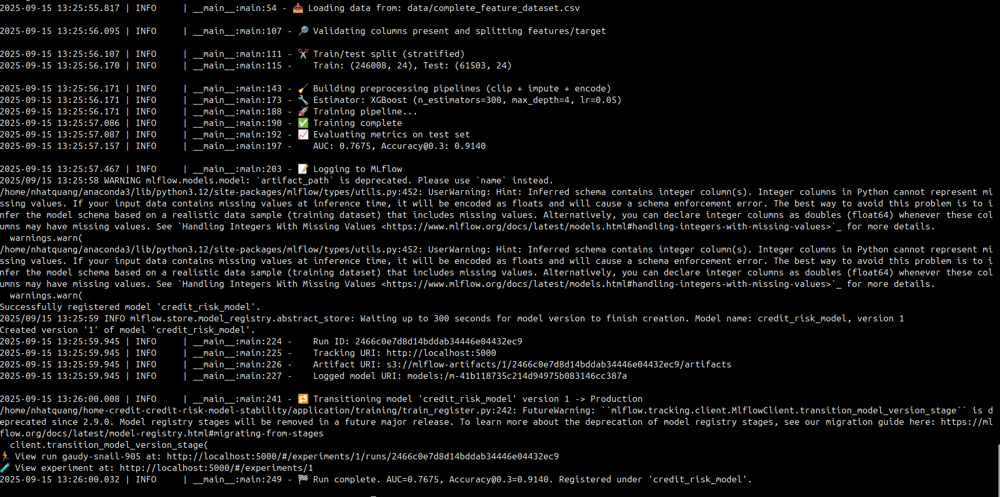

#### Spin up serving components
For the serving purpose, we will use bentoml since they make it easy for us to create endpoints and popular for serving ml applications. 

First, we will need to build the bentoml image, which is the same for docker images:

- Build and containerize the scoring service:
  - `cd application/scoring`
  - `bentoml build`
  - `bentoml containerize credit_risk_scoring:latest -t bentoml/credit-risk-model:v2`
  - `cd ../../`
- Start the scoring service (FastAPI on port 3000 by default):
  - `docker compose -f services/ml/docker-compose.serving.yml up -d credit-risk-service`
- Health check:
  - `curl -s http://localhost:3000/healthz`
- Score by ID (fetch features from Feast Redis via registry):
  - `curl -s -X POST http://localhost:3000/v1/score-by-id -H 'Content-Type: application/json' -d '{"sk_id_curr":"2587200"}'`
- Optional streaming scoring (Kafka → Feast → Model):
  - Publish a test event: `kcat -b broker:29092 -t hc.loan_application -P <<<'{"sk_id_curr":"2587200"}'`
  - Tail logs: `docker logs -f bento_credit_risk`

Notes
- The scoring service reads online features directly from Redis using Feast SDK and the shared registry at `application/feast/data/registry.db` (mounted via compose).
- If you deploy scoring separately without mounting the repo, set envs `SCORING_FEAST_REGISTRY_URI` and `SCORING_FEAST_REDIS_URL` to auto-generate a minimal Feast config at runtime.

#### Spin up k8s cluster for the machine learning purpose.
We already deploy each of the machine learning components. from feature store, model serving to model registry in a docker compose manner, which may not be the best options for real life scenario. 

Therefore the better option could be to deploy a dedicated K8s cluster to help us with this. The main reason here is that k8s help scale horizontally on demand with supports rolling, zero down time deployment safely.

Starting by running the K8s cluster:

```shell
# Due to resources constraint, here are the spec that I use, feel free to change it
minikube start -p mlops --kubernetes-version=v1.28.3 --driver=docker \
    --cpus=8 --memory=20000 --disk-size=100g --addons=ingress,metallb
```

We will use nginx for connectivity from k8s to docker compose

```shell
kubectl create ns nginx 
kubectl apply -f ./services/ml/k8s/gateway/configmap-stream.yaml 
helm install k8s-gateway . -f values.internal.yaml -n nginx
```

Additionally, we will use socat for connec

For the first components in the cluster, it's kubeflow pipeline for the training job, it support scheduling, parameterized run and rollback. In order to run this:
```shell
export PIPELINE_VERSION=2.14.0

kubectl apply -k "github.com/kubeflow/pipelines/manifests/kustomize/cluster-scoped-resources?ref=$PIPELINE_VERSION"
kubectl wait --for condition=established --timeout=60s crd/applications.app.k8s.io
#kubectl apply -k "github.com/kubeflow/pipelines/manifests/kustomize/env/dev?ref=$PIPELINE_VERSION"
kubectl apply -k "github.com/kubeflow/pipelines/manifests/kustomize/env/platform-agnostic?ref=$PIPELINE_VERSION"

# If keep seeing CrashLoop, run this right after
kubectl apply -k "github.com/kubeflow/pipelines/manifests/kustomize/env/platform-agnostic?ref=$PIPELINE_VERSION"
```

For the second component, it is the data storage layer, there are 2 main reason why we should dedicate an storage layer for the training pipeline:
- Versioning purpose: we store things in a minio bucket, seperate by time stamp, therefore we know what are the feature we use to train the model. 
- Avoid continuosly hitting clickhouse: some of the model may require we keep hitting clickhouse for data (i.e deep learning type) where each epoch is a called to the database, we want to avoid that as well. To run this:

```shell
# Create namespace
kubectl create ns training-data

# Create service
helm upgrade --install training-minio ./services/ml/k8s/training-data-storage -n training-data \
    -f services/ml/k8s/training-data-storage/minio.values.yaml
```

**Notice**: The current problem we have is that we need clickhouse container to write files to minio (clickhouse is on docker network). One strategy that we can use is to expose MinIO with service type LoadBalancer so it has an external IP and MetalLB announces that IP (layer 2) so traffic to external-IP:9000(9000 is minio port) reaches the MinIO services. Trade off here is that it require minikube tunnel. Therefore, start a new terminal:

```shell
minikube tunnel -p mlops
```

On another terminal, apply the config map for metallb:

```shell
kubectl apply -f services/ml/k8s/training-data-storage/metallb/configmap.yaml
```

After this, everything should be up and run correctly, you can just test it by execute into the clickhouse container and run this so that it load data: 

```shell
docker exec clickhouse_dwh clickhouse-client -q "SET s3_truncate_on_insert=1; \
INSERT INTO FUNCTION s3('http://172.18.0.12:30900/training-data/snapshots/ds=2025-09-19/loan_applications.csv','minio_user','minio_password','CSVWithNames') \
SELECT a.*, t.TARGET \
FROM application_mart.mart_application AS a \
INNER JOIN application_mart.mart_application_train AS t \
ON a.SK_ID_CURR = t.SK_ID_CURR"
```

For further working, we need to connect the mlops network with the hc-network that our docker compose is currently use.
```shell
# docker network connect hc-network mlops
```
After that, you can inspect the netowrk to see the IP address of both of this. We need to do this because services inside k8s cluster can not resolve the DNS name from services inside the docker compose, but they can interact with each other via IP address. To know the IP address from each network, just run this:

```shell
docker inspect mlops --format '{{range $key, $value := .NetworkSettings.Networks}}{{$key}}: {{$value.IPAddress}}{{"\n"}}{{end}}'
```

For the third component, we need the model storage, same as what we did with docker compose, we need mlflow for model registry, postgres and minio for model storage. To run this:

```shell
# Create namespace
kubectl create ns model-registry

# Create service
helm upgrade --install mlflow  ./services/ml/k8s/model-registry/ -n model-registry \
    -f services/ml/k8s/model-registry/values.internal.yaml

helm upgrade minio services/ml/k8s/model-registry/minio -n model-registry \
    -f services/ml/k8s/model-registry/minio/values.internal.yaml

      
```

For the fourth components, it is feature store. We need to setup feast and redis as an online storage for faster feature retrieval. Therefore, let do this step by step:

```shell
# Create namespace for feature registry
kubectl create ns feature-registry

# Dockerize the feast components in the applications. 
cd application/...

docker build ...

cd - 

# Load the feast repo into minikube 
minikube image load feast-repo:latest --profile=mlops
kubectl apply -k ./services/ml/k8s/feature-store-kustomize/ --context=mlops
```


For the fifth components, it is the serving services. We will use bentoml and yatai as our main model serving services because bentoml is easy to use and yatai make it easy to integrate it to current k8s flow that we have. Run these command line: 

```shell
# Create namespace
kubectl create ns model-serving
```


<Some picture here>

After that, you need to get an API token for later use, for example I just created one: d3719ch36grc73an8b70 

After that we may need to authenticate with yatai 

The serving plane chart create a webhook and expect cert manager ti mint is TLS cert. We need to install cert-manager first, the rerun the install. 

```shell
# Create namespace 
kubectl create ns cert-manager
helm upgrade --install cert-manager services/ml/k8s/cert-manager -n cert-manager \
    -f services/ml/k8s/cert-manager/values.override.yaml

```

After that, we can just create our main model serving pods

```shell
# Install model serving crds
helm upgrade --install yatai-deployment-crds services/ml/k8s/vendor-charts/yatai-deployment-crds -n model-serving 
# Insstall model serving 
helm upgrade --install yatai-deployment services/ml/k8s/model-serving-plane -n model-serving \
    -f services/ml/k8s/model-serving-plane/values.override.yaml
```

For the sixth components, it is the ray related components (notice that the first time run is quite slow, therefore be patient, it should be the case that the head is still creating while worker is init):

```shell
# Create ns
kubectl create ns ray 

# Start the ray operator
helm upgrade --install kuberay-operator ./services/ml/k8s/kuberay-operator \
    -n ray -f services/ml/k8s/kuberay-operator/values.yaml

# Start the ray cluster
 kubectl apply -f services/ml/k8s/kuberay-operator/raycluster.yaml
```
The current ray cluster setting is with 1 Master and 2 Workers, these will help with the distributed hyperparameter tuning and model training. Now we are full equipment for the training process. But first, we need to create a training pipeline script (written in yaml) so that later on we can submit this to kubeflow pipeline so that it do the tuning, training and registering for us. 

```shell
python services/ml/k8s/training-pipeline/compile_pipeline.py
```
After this, you will see a training_pipeline.yaml file. After that, you can actually just submit that on KFP and run with predetermined parameters and everything is ok. 


Later on, when navigate to mlflow, we will see the new model is created. Now is the fun part, we will create a watcher pod, what it do is essentially to create new serving pod in case we promote a new model, the webhook will sent a event, saying that we need to deploy the new model, after the new model is deployed healthy in the pod, we got 2 options:
1. Wait for the pod to become healthy, we stop the requests to go to the original pod, and just route to the new pod. 
2. Deploy these 2 simultenously, run with production data at the same time, later on we will audit if this new model is better on the long term and decide if we need to keep it. 

To deploy this watcher pod, simply run:

```shell

# 1. Create RBAC resources (ServiceAccount, Role, RoleBinding)
kubectl apply -f services/ml/k8s/mlflow-watcher/rbac.yaml

# 2. Deploy MLflow watcher components
kubectl -n model-registry apply \
-f services/ml/k8s/mlflow-watcher/poller-values.yaml \
-f services/ml/k8s/mlflow-watcher/poller-configmap.yaml \
-f services/ml/k8s/mlflow-watcher/builder-configmap.yaml \
-f services/ml/k8s/mlflow-watcher/deployment.yaml

# 3. Wait for deployment to be ready
kubectl -n model-registry rollout status deploy/mlflow-watcher
```

We will push our image to dockerhub, therefore we need to create secrets so that our k8s can access to dockerhub and pull the image

```shell
kubectl create secret generic dockerhub-creds \
  --from-literal=username=YOUR_DOCKERHUB_USERNAME \
  --from-literal=password=YOUR_DOCKERHUB_PASSWORD \
  -n model-serving

```

The current setup allow 2 types of model to be on production at the same time, later on if we just want to maintain 1 model, just drain out a request from 1 version, change the stage to not be production. 


#### Spin up spark cluster
Spark cluster enable us to handling big data efficiently, for this application, the current data is not too large (because it's already down-sample from a production setting environment), however, when dealing with production environment, perform model training on approx 100GB or more is normal, which exceed the capacity of just a single machine in most of the companies. Spark help us with this in a distributed manner. Also Spark is well known and have lots of documentation and lots of use case (ML is one of them), therefore I choose spark. 

In this setting, I set that there will be 1 master and 2 slaves. To spin the cluster up, simply run:

```shell
docker compose -f ./services/data/docker-compose.batch.yml up -d
```

#### Spin up orchestration components
Orchestration is crucial in modern data platforms because it automates, schedules, and coordinates complex workflows across multiple services and data pipelines. This ensures reliable data movement, timely processing, dependency management, and error handling, enabling scalable and maintainable operations for analytics and machine learning. Therefore, we will use Airflow for this. 

Airflow is an open-source workflow orchestration tool designed to programmatically author, schedule, and monitor data pipelines. It uses Directed Acyclic Graphs (DAGs) to define workflows, ensuring tasks are executed in the correct order with dependency management. Airflow ensures reliable, repeatable, and maintainable orchestration for our data and ML pipelines.

Run the following code to spin up airflow:

```shell
docker compose -f ./services/ops/docker-compose.orchestration.yml up -d
```

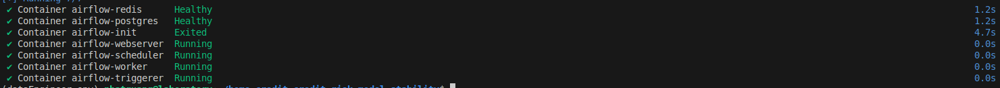


For more detail, access the localhost:9055, the username/password is airflow/airflow, just like the following. 


#### Spin up logging components


#### Spin up tracing components


#### Spin up BI components
  
