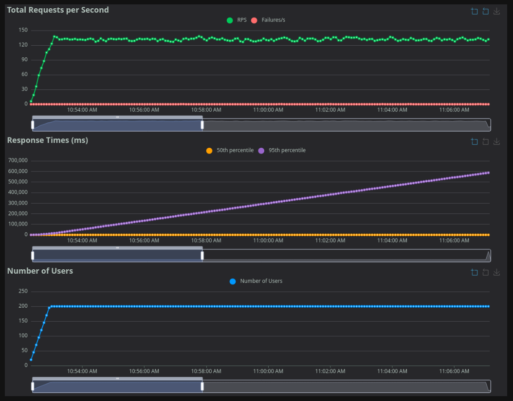
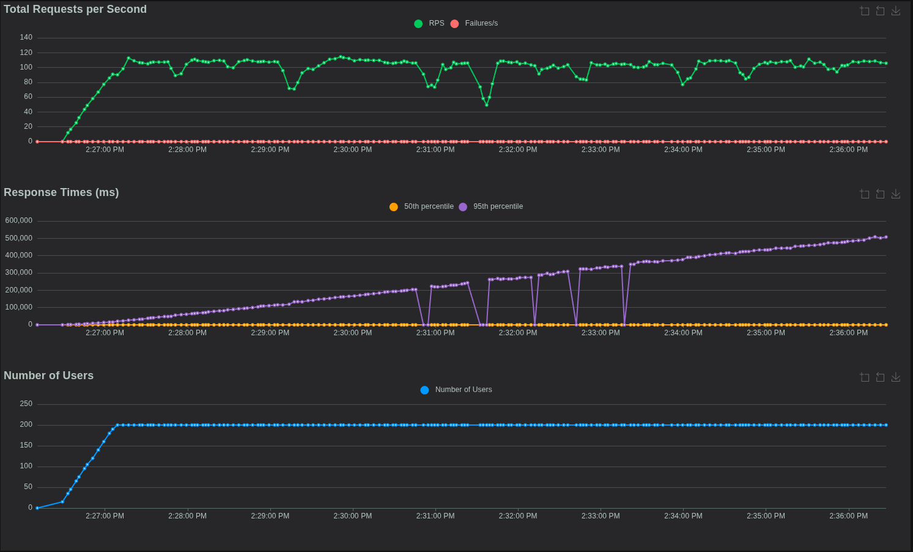

# Business Objectives
## What this delivers (business value)
- End-to-end credit risk decisioning that targets lower default rates, higher approval accuracy, and risk-adjusted growth. This application is 100% fully automated decision.
- Automated model promotion and serving so business teams can ship approved models without manual ops.
- Feature-store-backed, low-latency scoring (Kafka + Redis + KServe) designed for ~100 RPS and less than 10 min end-to-end SLA.


## System at a glance
- **Workloads**: Real-time scoring, batch training, CDC-based feature streaming, dashboards.
- **Stacks**: Docker Compose for data platform; Minikube/K8s for ML platform (KServe, Kubeflow, Feast, MLflow).
- **Data flow**: Postgres → Debezium/Kafka → Flink → Redis/ClickHouse → KServe/BentoML → Kafka.
- **Artifacts**: Models tracked in MLflow; bundles built with BentoML; features governed by Feast registry.

## About the application
This application is for lending money, fully automated decision, i.e the machine will do all the calculation and decide whether you are worthy with the money or not.

## Capabilities & components (where to look)
- **API & apps**: `application/api`, Streamlit UIs, FastAPI services, NGINX entry.
- **Data platform (Compose)**: Postgres + Debezium, Kafka + Schema Registry, ClickHouse, MinIO, Airflow, Superset, Redis.
- **Feature store**: Feast repo `application/feast_repo`, online Redis, offline ClickHouse, Flink materialization.
- **Training**: Kubeflow/Ray jobs, MLflow registry, training notebooks/pipelines under `application/training` and `application/scoring`.
- **Serving**: BentoML bundles, KServe InferenceServices, serving-watcher + mlflow-watcher in `services/ml/k8s/kserve`.
- **Observability**: ELK, Prometheus/Grafana, Jaeger; configs under `services/monitoring` and `services/ops`.
- **Ops scripts**: Helper scripts in `services/ops`; Make targets in `Makefile`.

## How to run (concise)
Prereqs: Docker, kubectl, Minikube 1.32+, Helm 3, 32 GB RAM at least if running full stack locally.

1) **Data platform (Docker Compose)**  
```bash
make create-network
make up-data           # Postgres, Debezium, Kafka, ClickHouse, MinIO, etc.
make up-monitoring     # ELK/Prometheus/Grafana/Jaeger
```

2) **ML platform (Minikube/K8s)**  
```bash
make k8s-up            # start minikube profile
make k8s-ml-platform   # deploy Feast, MLflow, KServe, serving/registry components
```

3) **Model flow**  
- Train & log to MLflow → watcher builds Bento bundle → bundle stored in MinIO → serving-watcher deploys KServe InferenceService → scoring pods consume Kafka and use Redis features.

See inline notes in `Makefile` and `services/ml/k8s/*` for environment-specific flags.

## Operations (adhoc scripts for fast clean up)
- **Restart after minikube IP change**: `services/ops/restart-k8s-after-minikube.sh`
- **Rebuild serving after model promotion**: Ensure mlflow-watcher and serving-watcher are running and reapply `isvc-template.yaml` if concurrency/replicas change.
- **Data backfill/materialize**: Feast materialization jobs (Flink to Redis); check Feast repo for feature definitions.
- **Clean start**: `docker system prune -a --volumes` and `minikube delete -p mlops` (already scripted in ops notes).

## Troubleshooting (quick pointers)
- **Kafka connectivity**: Ensure `broker:29092` reachable; if using socat gateway, restart `k8s_gateway`; check `services/ml/k8s/kserve/kafka-broker-service.yaml`.
- **Feast/feature drift**: Serving pod checks `feast_metadata.yaml`; redeploy registry or refresh online store if mismatch.
- **KServe cold start**: Startup probe on port 3000; minReplicas=1; autoscaling via Knative concurrency (target 100).
- **Cross-network**: Socat bridges Docker↔K8s; works for Minikube, replace with load balancer or VPC peering in production.

## Testing & quality
- Unit/integration test scaffolding under `tests/`; see `tests/README.md` for status and planned coverage.
- Load tests (Locust) were removed from `feature/ml-model-v1`; reintroduce via `tests/test_load` if needed.

## Roadmap / known gaps
- Migrate remaining Docker Compose services to Kubernetes/Helm for HA and also make ease of communication betwene services.
- Replace socat/Minikube-specific networking with cloud/K8s-native ingress and load balancers.
- Harden security: TLS/mTLS, secrets management, network policies, image scanning.
- Expand automated tests (integration with real DB/Kafka, E2E, load).
- Production-grade autoscaling and multi-AZ Kafka/Redis/Postgres replacements.

## Dataset (source)
- Home Credit Default Risk (Kaggle, ~3 GB). External (bureau) + internal (loan history) data. See Kaggle data dictionary for field meanings. Diagram: `assets/READMEimg/datamodeling.png`.

## Repository map (quick links)
- Apps/API: `application/api`, `application/services`
- Feature store: `application/feast_repo`
- Training/scoring: `application/training`, `application/scoring`
- K8s manifests: `services/ml/k8s/` (model-serving, registry, kserve, feature-store)
- Compose stacks: `services/data`, `services/monitoring`, `services/ops`
- CI/automation: `Makefile`, scripts in `services/ops`

## Deep dives (long-form)
- Architecture diagrams: `assets/READMEimg/*`
- Feast repo details: `application/feast_repo/`
- KServe templates and watchers: `services/ml/k8s/kserve/`
- Ops scripts: `services/ops/`
- Terraform (experimental): `infrastructure/terraform/README.md`

## Current status
- Built for local/dev & POC; production use requires infra substitutions (managed Kafka, Postgres, Redis; K8s ingress/load balancer; HA storage; security hardening).

## Assumptions

Based on my research on reddit, quora, and other platforms about how personal loan was handle and how long does it took, here are the assumptions that I make so that the architecture must follow: 

- **Processing time is expected to be within 1 day** from the moment the customer submit their loan application. Some institutions got a longer processing time, could be because they are not fully automated, i.e 70% of the steps are make by the machine, the rest 30% is by loan officiers.  

## Model results

After perform feature engineering, hyper-parameter tuning, the model achieve 80% AUC. 

The reason we choose AUC over Accuracy is because this is a imbalance dataset, choosing accuracy as the mandatory metrics does not reflect the whole situation. 

You can access the leader board here: 

## Perform load test and stress test

locust -f ./tests/test_load/locustfile_e2e_prediction.py --web-host=0.0.0.0 --web-port=8089 

# Guide to Install and Run Code

## Create network
We need to create network so that our services can communicate to each other
```shell
# Original
docker network create hc-network
# Or maybe we can
docker network create --subnet=172.18.0.0/16 hc-network

```
The result will look like this: 


This network will be share among services, this step is **crucial** because it allow the DNS of our services to be resolve and can be reach out durring message transfer

## Spin up API services and operational database
First, we need to bring up the API services and the operational database. 
```shell
docker compose --env-file ./services/core/.env.core \
    -f ./services/core/docker-compose.operationaldb.yml \
    -f ./services/core/docker-compose.api.yml \
    -f ./services/data/docker-compose.storage.yml \
    up -d
```
Just to be clear:
- API Services in this case including:
    - 1 Nginx to route customer requests.
    - 2 streamlit front-end for customer to navigate
    - 2 API services for sending and handling requests. 
- Operational database in this case including:
    - 1 file storage database (MinIO) for storing customer's documentation
    - 1 OLTP database (postgres) for storing day over day operational actions in the company. 
    - 1 PG Bouncer as a pooling layer in case there are multiple requests. 


## Spin up Data Platform
There are multiple things to work here, therefore stick with me.
### Spin up CDC and Event Bus components
In order to serve request in real-time with an event-driven manner, we will use Debezium for the change-data-capture (CDC) and Kafka. To spin these up, run the following command:
```shell
docker compose  --env-file ./services/core/.env.core \
 --env-file ./services/data/.env.data \
 -f ./services/data/docker-compose.streaming.yml \
 -f ./services/data/docker-compose.cdc.yml \
 up -d
```
This code will bring up the kafka components as well as the cdc components. 

For the CDC, there will be a helper connector that help connect Debezium to postgres using the postgres connector. 

For the Kafka, we will use zookeper for managing kafka cluster, schema registry to handle schema evolution, kafka ui from provectus labs for easier debugging process.


After everything is up, we need to create kafka topics, by running this following command: 

```python
python ./services/data/scripts/kafka/create_topics.py 
```

If navigate to kafka ui, we will see that there are some topics that has been created


Additionally, if we check on debezium ui, we will also see that the Postgres connector is also created.


### Spin up DWH, Data Mart and External Data.
In real life scenario, there are some data that we can not store in our datawarehouse or our operational database, because we basically dont have that kind of information and either are our customers. Therefore we need data from external sources, a dedicated third-party company that gather all the data and do some kind of transformation. And in that case, often we will need to get the data via some API being provided. 

In other to bring up the datawarehouse as well as external data, we will run: 

```shell
docker compose --env-file ./services/core/.env.core \
 --env-file ./services/data/.env.data  \
 -f ./services/data/docker-compose.warehouse.yml \ 
 up -d
```

Then, wait until all the container are started:


After that, we need to parse in some data. For simplicity, instead of create 2 different dwh (1 is the company's internal dwh and 1 is the bureau's external dwh), I will just merge it into 1 data warehouse with different naming convention. 

In terms of the Medallion Data Architecture, what we just bring up are called the *silver layer*. 

```shell
# For internal data
bash ./services/data/scripts/dwh/ch_load_internal.sh
# For external data
bash ./services/data/scripts/dwh/ch_load_external.sh
```

For data that are specialized and ready to use in our data mart, we will need to run dbt to perform the data transfomartion step from the *silver layer* to the *gold layer*. These transformation are applied only to our internal data warehouse because we dont have the audacity to do that with external sources.

```shell
cd ml_data_mart/
# Run the debug to see if we are missing anything
dbt debug --project-dir . --profiles-dir .
# Run the transformation
dbt run --project-dir . --profiles-dir . --target gold
```

After the transformation, it will output to be something like this:


If you notice, you will see that these are under the data mart database with the prefix mart_. These will be run daily, thanks to the power of clickhouse, the transformation step will be very quick. 

After that, we also need to setup a query service. These query services will aggregate the query data that serve the modeling purpose. In some company, it's the ML Engineer that will do this step. The logic of the aggregation is taken from the ./notebooks/ folder. To bring these up, run the following: 

```shell
docker compose --env-file ./services/data/.env.data \
    -f ./services/data/docker-compose.query-services.yml \
    up -d
```


**Note**: The query services here are written in python for the aggregation, based on historical data, these aggregation are fast and lightweight, however later on when we receive more and more request, these aggregation could become our bottleneck. The solution to this is maybe written code in another language/library that is faster, could be cython or maybe sth else. 

### Spin up Flink and submit Flink Job
We need Flink to handle the streaming processing part of the incoming data from the kafka topic. 

```shell
docker compose --env-file ./services/data/.env.data \ 
    -f services/data/docker-compose.flink.yml \
    up -d
```
As describe earlier, there will be 2 flink jobs that work simultaneously. One job will perform PII masking and another job will do the transformation for the external data to match the format that we have for downstream task such as data visualization or machine learning inference. 

Here is what it look like after you have spin up Flink and submit those 2 jobs (just run the docker compose above, the job will automatically submit).


The first job appear is for the PII masking, the second job appear is for the transformation step. 

### Spin up Filebeat and Cadvisor for logging and monitoring

As shows earlier in the logging and monitoring, here is how we setup these

```shell
# Deploy filebeat
docker compose -f services/ops/docker-compose.logging.yml up -d
# Deploy cadvisor
docker compose -f services/ops/docker-compose.monitoring.yml up -d
```

#### Spin up Superset for BI

We also use superset for visualization. The reason is quite simple, **superset is open-source, SQL-native, have tons of plugin for different databases**. 

I know lots of company use other things like PowerBI and Tableau. Eventhough they have free tier, but for enterprise, we still need a pay version of these. 

To spin up Superset, simply run: 

```shell
docker compose -f services/ops/docker-compose.dashboard.yml up -d
```

After running, you can access to `http://localhost:8089` and start building dashboard. The username/password is admin/admin

Now here, you can config to connect to either Clickhouse (our data warehouse and data mart) or Postgres (our operational database).

## Spin up Machine Learning Platform. 
Previously, I already deploy each of the machine learning components. From feature store, model serving to model registry in a docker compose manner, which may not be the best options for real life scenario. 

Therefore the better option could be to deploy a dedicated K8s cluster to help us with this. The main reason here is that k8s help scale horizontally on demand with supports rolling, zero down time deployment safely.

### Create cluster using minikube
Starting by running the K8s cluster:

```shell
# Due to resources constraint, here are the spec that I use, feel free to change it
minikube start -p mlops --kubernetes-version=v1.28.3 --driver=docker \
    --cpus=12 --memory=10000 --disk-size=100g --addons=ingress,metallb
```

**Notice**: This is the only resource left on my pc :) The data platform itself consume lots of space lollll. The recommend CPU/Memory ratio is 1:4 or around that, i.e 64c256g or 20c80g something like that

### Create socat layer

Socat is used as a TCP relay/proxy to bridge Docker Compose and Kubernetes networking. It forwards Kafka traffic from the Docker network to Kubernetes pods.

**How it works:**
- Socat runs in Docker Compose and listens on `host:39092`
- It forwards traffic to `kafka_broker:29092` in the Docker network
- Kubernetes pods access Kafka via `host.minikube.internal:39092`
- The `kafka-broker-service.yaml` (deployed in KServe setup) provides DNS resolution for pods

```shell
make start-gateway
```

**Note**:
- Always use `make start-gateway` instead of direct docker-compose commands - it automatically detects current Minikube and Kafka IPs
- If IPs change (after restarting Minikube or Kafka), use `make restart-gateway` to update the gateway
- This is a Minikube-specific solution. For production cloud deployments, use VPC peering or deploy all services in Kubernetes to eliminate the need for socat.

### Create training data storage

For the first component, it is the data storage layer, there are 2 main reason why we should dedicate an storage layer for the training pipeline:
- Versioning purpose: we store things in a minio bucket, seperate by time stamp, therefore we know what are the feature we use to train the model. 
- Avoid continuosly hitting clickhouse: some of the model may require we keep hitting clickhouse for data (i.e deep learning type) where each epoch is a called to the database, we want to avoid that as well. To run this:

```shell
# Create namespace
kubectl create ns training-data

# Create service
helm upgrade --install training-minio ./services/ml/k8s/training-data-storage -n training-data \
    -f services/ml/k8s/training-data-storage/minio.values.yaml
```

After this, everything should be up and run correctly, you can just test it by execute into the clickhouse container and run this so that it load data: 

```shell
docker exec clickhouse_dwh clickhouse-client -q "SET s3_truncate_on_insert=1; \
INSERT INTO FUNCTION s3('http://172.18.0.1:31900/training-data/snapshots/ds=2025-09-19/loan_applications.csv','minioadmin','minioadmin','CSVWithNames') \
SELECT a.*, t.TARGET \
FROM application_mart.mart_application AS a \
INNER JOIN application_mart.mart_application_train AS t \
ON a.SK_ID_CURR = t.SK_ID_CURR"
```

!<INSERT HERE>

### Create Kubeflow pipeline

For the second components in the cluster, it's kubeflow pipeline for the training job, it support scheduling, parameterized run and rollback. In order to run this, execute the command below:
```shell
export PIPELINE_VERSION=2.14.0

kubectl apply -k "github.com/kubeflow/pipelines/manifests/kustomize/cluster-scoped-resources?ref=$PIPELINE_VERSION"
kubectl wait --for condition=established --timeout=60s crd/applications.app.k8s.io
kubectl apply -k "github.com/kubeflow/pipelines/manifests/kustomize/env/platform-agnostic?ref=$PIPELINE_VERSION"
```

You can find a more detail version of the installation [here](https://www.kubeflow.org/docs/components/pipelines/operator-guides/installation/). After that you can do port-forwarding, access the UI, create the pipeline and submit a `training_pipeline.yaml`. 

**Notice**: The first time install kubeflow pipeline will take a while because the docker images are really heavy.

Since we are doing hyper-param tuning with Ray, we must spin Ray cluster up (notice that the first time run is quite slow, therefore be patient, it should be the case that the head is still creating while worker is init):

```shell
# Create ns
kubectl create ns ray 

# Start the ray operator
helm upgrade --install kuberay-operator ./services/ml/k8s/kuberay-operator \
    -n ray -f services/ml/k8s/kuberay-operator/values.yaml

# Start the ray cluster
 kubectl apply -f services/ml/k8s/kuberay-operator/raycluster.yaml
```
The current ray cluster setting is with 1 Master and 2 Workers, these will help with the distributed hyperparameter tuning and model training. Now we are full equipment for the training process.

### Create model registry

For the third component, we need the model storage, same as what we did with docker compose, we need mlflow for model registry, postgres and minio for model storage. To run this:

```shell
# Create namespace
kubectl create ns model-registry

# Create service
helm upgrade --install mlflow  ./services/ml/k8s/model-registry/ -n model-registry \
    -f services/ml/k8s/model-registry/values.internal.yaml

helm upgrade --install minio services/ml/k8s/model-registry/minio -n model-registry \
    -f services/ml/k8s/model-registry/minio/values.internal.yaml

      
```

But first, we need to create a training pipeline script (written in yaml) so that later on we can submit this to kubeflow pipeline so that it do the tuning, training and registering for us. 

This is the path to that `training_pipeline.yaml`: services/ml/k8s/training-pipeline/training_pipeline.yaml

This path is actually an combiled version of the services/ml/k8s/training-pipeline/pipeline.py


What this is doing behind the scene is that: 
1. Read the data in the data storage component (minIO)
2. Perform some basic data transformation for ML such as encoding, normalization, etc. 
3. Based on that training feature, perform hyperparameter tuning. 
4. With the best set of hyperparameter, it perform training and registry to the mlflow (registry both the data processing pipeline, the model and the feature that it use to train).

Here are how we create and submit our training pipeline onto kubeflow:

!<Insert here>

You will see that kubeflow is actually create some pod to run the job, each pod correspond to one component in our pipeline. Later on, when navigate to mlflow, we will see the new model is created. Here is what it's look like: 

!<Insert here>

### Create model-serving 

We need to install Kserve

```shell
# 1. Create RBAC resources (ServiceAccount, Role, RoleBinding)
kubectl create ns kserve
kubectl apply -f services/ml/k8s/kserve/cert-manager.yaml
kubectl apply -f services/ml/k8s/kserve/standard-install.yaml

# 2. Install kserve
cd services/ml/k8s/kserve/kserve-crd
helm install kserve-crd . -n kserve

# 3. Wait until everything is ready and run the below
cd ../kserve-main
helm install kserve . -n kserve

# 4. Deploy bento-builder config map
kubectl apply -f services/ml/k8s/kserve/bento-builder/configmap.yaml

# 5. Configure Kafka DNS resolution for scoring pods
# This service maps 'broker:29092' DNS name to the socat gateway
kubectl apply -f services/ml/k8s/kserve/kafka-broker-service.yaml
```
### Create mlflow-watcher

Now is the fun part, we will create a watcher pod, what it do is essentially to create new serving pod in case we promote a new model:

**How the model deployment pipeline works:**
1. **MLflow watcher** polls MLflow for new model versions promoted to Production/Staging
2. When detected, it triggers a **bento-build Job** that:
   - Downloads the model from MLflow
   - Downloads `feast_metadata.yaml` from the same MLflow run (contains feature list)
   - Packages both into a Bento bundle
   - Uploads to MinIO storage
3. **Serving watcher** monitors MinIO for new Bento bundles
4. When found, creates a new KServe InferenceService
5. KServe deploys the new model with automatic:
   - Canary rollout (gradual traffic shift)
   - Health checks
   - Autoscaling

**Deployment strategies available:**
1. **Blue-green**: Wait for new pod to become healthy, then route 100% traffic to it
2. **Canary**: Deploy both simultaneously, gradually shift traffic from old to new while monitoring metrics

To deploy this watcher pod, simply run:

```shell
# 1. Create rbac since this will work cross-namespace
kubectl apply -f services/ml/k8s/mlflow-watcher/rbac.yaml

# 2. Deploy MLflow watcher components
kubectl -n model-registry apply \
-f services/ml/k8s/mlflow-watcher/poller-values.yaml \
-f services/ml/k8s/mlflow-watcher/poller-configmap.yaml \
-f services/ml/k8s/mlflow-watcher/builder-configmap.yaml \
-f services/ml/k8s/mlflow-watcher/deployment.yaml

# 3. Wait for deployment to be ready
kubectl -n model-registry rollout status deploy/mlflow-watcher

```

### Create model-serving components

```shell
# Create namespace
kubectl create ns model-serving
```
We will push our image to dockerhub, therefore we need to create secrets so that our k8s can access to dockerhub and pull the image

```shell
kubectl create secret generic dockerhub-creds \
  --from-literal=username=YOUR_DOCKERHUB_USERNAME \
  --from-literal=password=YOUR_DOCKERHUB_PASSWORD \
  -n model-serving
```

Now we need to update watcher config (same working mechanism for the mlflow poller, but this is for minio to containerize all the files)

```shell
cd services/ml/k8s/model-serving

# Deploy MinIO for BentoML bundles
cd bundle-storage
helm install serving-minio . -n model-serving -f values.internal.yaml

# Deploy Docker registry (OPTIONAL - for airgapped environments)
# Note: By default, the watcher pushes images to DockerHub (docker.io/ngnquanq/credit-risk-scoring)
# Only deploy this if you need an in-cluster registry for airgapped environments
cd ..
# kubectl apply -f registry-deployment.yaml  # Uncomment if needed

# Deploy serving watcher (automation)
# Note: watcher-configmap.yaml contains Kafka connection settings
kubectl apply -f watcher-rbac.yaml
kubectl apply -f watcher-configmap.yaml
kubectl apply -f watcher-deployment.yaml

# Restart watcher to pick up any config changes
kubectl rollout restart -n model-serving deployment/serving-watcher
```

### Create feature registry components

For the feature registry components, we will use feast as our feature registry and redis as our online store. This allow inference service to retrieve data fast. 

We need to containerize it first, push to dockerhub 
```shell
docker build ./application/feast_repo/ -t ngnquanq/feast-repo:v15
docker push ngnquanq/feast-repo:v15
```
and then run the following

```shell
kubectl create ns feature-registry

kubectl apply -k ./services/ml/k8s/feature-store/
```

### Create monitoring components
For the monitoring, we will use the prometheus-grafana stack. With prometheus for storing time series data about metrics (CPU util, Usage Memory, RAM, etc ...), Grafana will serve as a visualization tool for Platform Engineer, we use node-exporter for host-level metrics and cAdvisor on data platform and machine learning platform for container-level metrics. 

To setup this, simply run: 

```shell
# Create namespace
kubectl create namespace monitoring

# Install kube-prometheus-stack with custom values
cd services/ops/k8s/monitoring
helm upgrade --install kube-prometheus-stack ./kube-prometheus-stack \
-n monitoring \
-f kube-prometheus-stack/values.custom.yaml

# Deploy cAdvisor ServiceMonitor (to scrape Docker metrics)
kubectl apply -f kube-prometheus-stack/docker-cadvisor-servicemonitor.yaml

```
After that, you can do port-forwarding and access to the Grafana dashboard to see both dashboard for data platform and machine learning platform. 


### Create logging components 
For this logging components, we use the EFK stack (Elastic Search - Filebeat - Kibana) for centralized logging. ElasticSearch is the log storage, Kibana is the log visualization and search UI, you can even build some dashboard with this (the approach is very similar to using Superset or Grafana) and finally we deploy filebeat as daemonset to collect pod logs

To run this, simply run: 

```shell
# Create logigng namespace
kubectl create ns logging

# Install elastic search
cd services/ops/k8s/logging/elastic-stack

helm upgrade --install elasticsearch ./elasticsearch -n logging -f \
  elasticsearch-values.custom.yaml

# Then create the secrets
kubectl create secret generic elasticsearch-master-credentials -n logging \
      --from-literal=username=elastic --from-literal=password=changeme

# After elastic Search is up and running, start to install kibana
helm install kibana ./kibana -n logging -f kibana-values.custom.yaml --no-hooks

# After Kibana is up and running, run filebeat
helm install filebeat ./filebeat -n logging -f filebeat-values.custom.yaml

```
After that, you can do port-forwarding and access to the Kibana dashboard to see both dashboard for data platform and machine learning platform. 


#### Spin up spark cluster
Spark cluster enable us to handling big data efficiently, for this application, the current data is not too large (because it's already down-sample from a production setting environment), however, when dealing with production environment, perform model training on approx 100GB or more is normal, which exceed the capacity of just a single machine in most of the companies. Spark help us with this in a distributed manner. Also Spark is well known and have lots of documentation and lots of use case (ML is one of them), therefore I choose spark. 

In this setting, I set that there will be 1 master and 2 slaves. To spin the cluster up, simply run:

```shell
docker compose -f ./services/data/docker-compose.batch.yml up -d
```

#### Spin up orchestration components
Orchestration is crucial in modern data platforms because it automates, schedules, and coordinates complex workflows across multiple services and data pipelines. This ensures reliable data movement, timely processing, dependency management, and error handling, enabling scalable and maintainable operations for analytics and machine learning. Therefore, we will use Airflow for this. 

Airflow is an open-source workflow orchestration tool designed to programmatically author, schedule, and monitor data pipelines. It uses Directed Acyclic Graphs (DAGs) to define workflows, ensuring tasks are executed in the correct order with dependency management. Airflow ensures reliable, repeatable, and maintainable orchestration for our data and ML pipelines.

Run the following code to spin up airflow:

```shell
docker compose -f ./services/ops/docker-compose.orchestration.yml up -d
```


For more detail, access the localhost:9055, the username/password is airflow/airflow, just like the following. 


# Performance Bottlenecks and how to overcome it

These section bellow is like a diary of major change in the system. This time we will try to 

## Record on Oct 25
- The setup (aim for the baseline):
    - Peak user: 200 concurrent users
    - Ramp up: 5 user/sec
    - Duration: 10 min



- The results (TLDR: backend is not scaling with concurrency):
    - RPS is stable aorund 120-130, that's good for me, seems like there is no falling over from just throughput. 
    - p50 response time is low aand fine but the p95 is climbing linearly, raech around 7 min at the end (this is **acceptable for in-day application** but **fail the 3 min objective**)

- Bottleneck that is detected is mostly coming from blocking I/O or DB bottleneck, not the heavy computing from CPU (most core sitting around 30-60%): 
    - **Problem 1:** Serialized in serving pod. With current setup, we are implement a simple retry logic, that is we will try to look into feast at most 15 times, the time gap between each is 300ms, therefore in worst case scenario, each thread have to wait 4.5 sec to consume the next request. Therefore we have no parallism. 
    - **Solutions:**  We will let stream processor to write to another kafka topic (hc.feature_ready) with the key is the SK_ID_CURR, and then serving pod will consume the message in that topic to know when the data is ready. If we do it that way, we allow multi-thread processing since we don't hold any CPU core for 4.5s at most. For the audit, we will compare the time gap between the hc.scoring and the hc.application.public topic to see if it match our objective or not.  
    - **Problem 2**: Only one query container for each internal and external database, we need to scale this up horizontally. We could try scaling from 1-3 
    - **Solutions**: Add more :D


## Record on Oct 30
- The setup (aim for the baseline):
    - Peak user: 200 concurrent users
    - Ramp up: 5 user/sec
    - Duration: 10 min



- The results: 
    - RPS is in the area 80-120, no fail logs, that's good for me, seems like through put still not an error. 
    - p50 is the same, p95 is not good, even though reduce the time. However the response time is faster by 100 sec, which is good, but we can do more. Quite fun fact is that based on the system monitor on my PC, seems like we have max out everything we got (RAM, CPU, even use the swap ram :(, but there are still room for improvement))

- Bottleneck that is detected is mostly come from I/O related operations and resource allocated and model optimization. Here are the problems I found. 
    - **Problem 1** XGBoost threading issues: we don't specify the number of thread during inference, therefore each predictions can tries to use all system core, which may cause overhead for context switching, which make the CPU seems to be busy, but infact they may not that busy, they just do un important things. 
    - **Solution**: Config the thread during inference, or we could just move to lightgbm for faster inference.     
    - **Problem 2**: When I check the data flow, it took 6 min for feast materialization, this suggests redis write throughput is saturated. Multiple workers write synchronously to a single Redis instance. 
    - **Solution**: Let try and scale redis horizontally 

## Record on Nov 02
- The setup (aim for the baseline):
    - Peak user: 200 concurrent users
    - Ramp up: 5 user/sec
    - Duration: 10 min


- Ther results: 
    - RPS is in range 120-150, mostly stable arround 140 RPS, and again, no fail logs. 
    - P50 is the same, p95 is better than before. We do still got the queue up situataion, however this time, instead of 500s, we able to reduce it to only 350s, a big improvement. This happen because of 2 things. 
        - We implement the micro batch ingestion to redis, the logic is very similar to the spark streaming, it could be either enough 200 request or 300ms. The reason is that during peak workload, i.e we are doing for 500 user at the sametime, the batch 200 may kick in first before the time of the batch, or maybe during normal workload, the 300ms hit first. This approach is to compromise for both normal and heavy workload in case we don't know what will happen first. What make this different from the original logic is that instead of transform every single request to pd.DataFrame format, we could actually get a load of it and transform, then write at the sametime, this approach reduce the round-trip of each write up, therefore more efficient during high traffic workload, the trade-off here is that the throughput may be higher, but this is small, I test it, kafka still handle it normally. 

        - We also do some model optimization in the inference phase, we carefully choose the number of worker, number of thread, number of pod, the resources for that services. However, there are still room for more improvement. Currently we are setting #serving_pods = #partition_in_topic(hc.feature_ready). We could add more pod and implement a load balancer to fan out all these request, therefore maximize the capability of the serving components


# Future Development
1. Definitely to prepare the infrastructure to be production ready, I could deploy this using managed services from cloud provider or maybe migrate the whole things to run with K8s and bring that cluster onto cloud. 
2. Define more business rule, I know that these application often integrate some rule-based as well. 
3. Authentication and Authorization as the security layer. 
4. Dedicate some time to build meaningful dashboard (Kibana, Grafana and Superset)
5. Some components are handling both read and write at the same time (i.e our data warehouse). One approach could be to implement database replication (master-slave approach), we will write to the master database and read from the slave database. Clickhouse already have a guidance on how to do this here in this [link](https://clickhouse.com/docs/engines/table-engines/mergetree-family/replication). If we go further,
6. **Optimize the current data platform (most critical)**, here is how I would do it: 
    - Migrate everything into k8s for scalability. 
    - Optimize Kafka components. With the current setup, kafka is running with single-threaded consumer.
    - Optimize the retry logic in the serving pod.
7. Get more data via OCR or text extraction, remember that we do allow user to send some pdf files like their payslips, driver license etc? We can extract more information given that, i.e their address, their income (the one that shows on the payslips), their insurance contract etc. 

# Reference
- [Building async ML Inference Pipelines with Knative Eventing and Kserve](https://medium.com/cars24-data-science-blog/building-asynchronous-ml-inference-pipelines-with-knative-eventing-and-kserve-79a7ab80bc79)