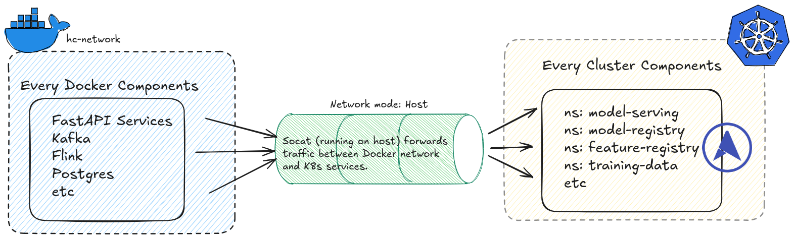

# Business Objective

**Improve key lending KPIs via predictive risk modeling:**

- **Default rate reduction** – lower the proportion of loan applicants who default
- **Loan approval efficiency** – increase approvals for low-risk borrowers
- **Loss mitigation** – reduce financial losses from write-offs
- **Customer retention** – minimize rejection of good customers and reduce churn
- **Risk-adjusted revenue growth** – enable differentiated pricing for different risk tiers

*(All entities are fictional—“Alpha Lending” is a placeholder.)*

## About the application
This application is for lending money, fully automated decision, i.e the machine will do all the calculation and decide whether you are worthy with the money or not.

Some of the aggrement about the application:
- SLA approximately 3 minuites (180 second)
- Fully automated decision making
- Resilient to external latency and failures via retries and DLQ

Some of the assumptions about the external system:
- SLA as explained by the credit bureau is under 1 min. 
- Availability is >= 99%/monthly 
## Situation

Alpha Lending processes thousands of loan applications monthly. A large share of applicants have limited or no formal credit history. This creates two challenges:

- **Revenue loss**: Many low-risk customers are wrongly rejected due to insufficient information.  
- **Credit losses**: Some high-risk applicants are incorrectly approved, leading to higher default rates.  

The company has diverse data sources—application forms, bureau records, past loan performance, credit card balances, and repayment histories—but lacks a unified, data-driven solution to leverage them for accurate decision-making.

## Task

Design and implement a **machine learning solution** that predicts the probability of default for each applicant.  
The solution must directly support the business objective by:

- Reducing default rates among approved loans  
- Increasing approvals of creditworthy applicants  
- Providing interpretable outputs for decision-makers  
- Allowing integration into the existing loan approval pipeline  

## Action

### Data Science Team
- **Data integration**: Consolidate application, bureau, previous credit, and repayment datasets into a single analytical view.  
- **Feature engineering**: Derive risk indicators (e.g., debt-to-income ratios, missed payment counts, external risk scores).  
- **Model development**: Train and validate predictive models (e.g., gradient boosting) with ROC-AUC as the primary evaluation metric.  
- **Interpretability**: Provide probability scores and explanations (e.g., SHAP values) to ensure business usability.  
- **Deployment readiness**: Deliver APIs or batch scoring pipelines that can be embedded into operational systems.  

### Business Team
- **Define acceptance thresholds**: Work with DS team to set default-probability cutoffs that balance growth vs. risk.  
- **Policy alignment**: Adapt credit approval rules and pricing strategies based on model outputs.  
- **Operational integration**: Train loan officers on interpreting model results and using them in decision-making.  
- **Monitoring & feedback**: Establish KPIs to continuously track impact (default rates, approval rates, revenue changes).  

## Result

*To be determined after deployment and monitoring phase.*

# Dataset

This dataset is from kaggle, provided by home credit. You can download the data here via this [link](https://www.kaggle.com/competitions/home-credit-default-risk).

The dataset is very rich, around 3GB in total (you can find another version that is bigger also from home credit on kaggle as well). 

There will be 2 main sources of data in my opinion:

1. External data: Those that you can get from external sources, i.e CIC or any third party that's already calculate your credit score. 
2. Internal data: Including your previous loan, your spending behavior, etc ...


For a more in-dept detail of this dataset, I suggest you go and take a look of it. It took me a while to truly grasp what is the dataset about and how these are related to each other. 

**Note**: When you download the data from Kaggle, it also have a data dictionary file as well. Make sure to take a look at this to have a high level overview of what these files are doing and the content of it. 

# Repository Structure


# High-level System Architecture 

## Machine Spec
### Minimum Recommended Specifications
The following specifications are based on the development/testing environment:

**Hardware:**
- **CPU**: 12+ cores (24 threads) - AMD Ryzen 9 9900X or equivalent
- **RAM**: 32 GB minimum (for running full stack with K8s + Docker Compose)
- **Storage**:
  - 500 GB NVMe SSD (for OS and containers)
  - 1 TB+ additional storage (for data, model artifacts, logs)
  - Fast disk I/O recommended for database workloads

**Software:**
- **OS**: Ubuntu 24.04 LTS or compatible Linux distribution
- **Kernel**: 6.14+ (for Docker and K8s compatibility)
- **Docker**: 24.0+
- **Minikube**: 1.32+
- **Kubernetes**: 1.28+

### Resource Allocation for Services
When running the full stack:
- **Docker containers**: ~20-25 GB RAM usage
- **Minikube cluster**: 10-20 GB RAM, 10 CPUs (configurable)
- **Disk space**:
  - Docker images/containers: ~30-50 GB
  - Data warehouse (ClickHouse): ~50-100 GB
  - Model artifacts: ~10-20 GB
  - Logs and temporary files: ~20 GB

**Note**: For production deployments, scale resources based on data volume and request
throughput. Later on we will have some load test to see if our application can handle things at the same time or not. Therefore strong machine can benefit a little bit. 

## Overall Architecture
Here is what the system architecture look like on a high level. 


More precisely: 
- In this system, we use Lambda Architecture (combining batch processing with real-time streaming) with Medallion Architecture as our data design pattern 
- There are 2 distinct environment in this system: Docker compose (mostly for data platform) and Kubernetes (mostly for ML platform). 
- This is a data driven design that aim to help approve loan in near-real time (less than 5 sec) with high sla. 

### Architecture Layers

#### 1. **Application Layer** (Docker Compose)
- **User-facing services**: NGINX → Streamlit frontends → FastAPI backends
- **Operational database**: PostgreSQL with PgBouncer for connection pooling
- **File storage**: MinIO for customer documents and model artifacts

#### 2. **Event-Driven Streaming** (Kafka Ecosystem)
- **CDC pipeline**: Debezium captures PostgreSQL changes → Kafka topics
- **Stream processing**: Apache Flink for real-time feature computation
- **Schema management**: Confluent Schema Registry for data contracts

#### 3. **Data Platform** (Batch & Analytical)
- **Operational database**: Postgres and MinIO (Bronze)
- **Data warehouse** and **Data mart**: ClickHouse (silver, gold)
- **Batch processing**: Apache Spark for large-scale feature engineering, model training.
- **Orchestration**: Apache Airflow scheduling dbt transformations and ETL jobs
- **Visualization**: Apache Superset for BI developer and DA to create dashboard. 
- **Feature Storage**: Using Redis as online store for fast data retrieval.

#### 4. **Feature Store** (Feast)
- **Offline store**: Historical features from ClickHouse (training datasets)
- **Online store**: Real-time features in Redis (sub-100ms serving)
- **Materialization**: Automated sync Kafka → Redis for fresh features

#### 5. **ML Training Platform** (Kubernetes)
- **Pipeline orchestration**: Kubeflow Pipelines for reproducible experiments
- **Distributed training**: Ray cluster for hyperparameter tuning
- **Model registry**: MLflow tracking experiments, versioning models
- **Automation**: MLflow watcher triggers builds on Production promotions

#### 6. **ML Serving Platform** (Kubernetes + KServe)
- **Model packaging**: BentoML bundles (model + Feast metadata)
- **Deployment**: KServe InferenceServices with canary/blue-green strategies
- **Validation**: Startup checks ensure feature registry alignment

#### 7. **Observability Layer** (ELK + Promethus-Grafana)
- **Logging**: Filebeat for log collection, Elastic Search for storage, Kibana for visualization. 
- **Monitoring**: Cadvisor for metrics collection (container-level resources), Prometheus for scrapes and store time-series metrics. Grafana for visualize with prebuilt dashboards. 

### Key Design Patterns

1. **Event-Driven Architecture**: CDC + Kafka ensures eventual consistency across
systems
2. **Hybrid Deployment**: Docker Compose (data platform) + Kubernetes (ML platform)
3. **Feature-Model Contract**: `feast_metadata.yaml` prevents train-serve skew
4. **Automated MLOps**: Watchers + Jobs eliminate manual deployment steps
5. **Separation of Concerns**: Distinct networks/namespaces for security and isolation
6. **Lambda Architecture**: Combines batch processing (Spark/ClickHouse) with real-time
streaming (Kafka/Flink) for balanced accuracy and latency
7. **Medallion Architecture**: 3-tier data refinement (Bronze: raw operational data;
Silver: validated warehouse; Gold: business-ready data marts)

## Data Flow for Serving Pods
Here is how the data flow from the moment a user submit a loan request to when the decision of that loan is made. 


For a more detail version, it will be this: 

1. The user submit a loan request
2. All the information about the loan will go to the operational database (postgres)
3. CDC that connect operational database (postgres) and event bus (kafka) will capture this new request, create a message and push into the event bus under the topic `hc.applications.public.loan_applications` with the `KEY=SK_ID_CURR`
4. Given that new message, here are what gonna happen at the same time: 
    - A Flink job consume that message and perform PII masking. This Flink job will push into the event bus under the topic `hc.application_features`
    - A python job will query from the external sources (bureau data), write the data to the topic `hc.application_ext_raw`, another Flink job will consume message from topic, do some aggregation and then produce to the topic `hc.application_ext`. The reason we split into 2 topic is because later on, we will sync the original data from external sources into our data warehouse for model training so that our model get external data as well (hint: external data contribute a lot to the model's performance)
    - Another python job will query from the data mart (internal data), write the data to the topic `hc.application_dwh`.
5. All of those 3 topics that I mentioned be consume by a python service called feast consumer. Since this is just concatenate these fields together, a simple python script can do this. The combined data will be pushed into an online storage (redis) for the serving pod to use. 
6. During the aggregation, the serving pod (or scoring worker) will consume the raw event, and then query from redis to get the features it need.
7. After inference, the serving pod will write back to kafka under the topic `hc.scoring`. In future, there will be other services that consume this topic, it could be the notification services or something like that. 

**Note 1**: It is absolutely the case that the scoring worker will consume the message before the data is ready in feast redis. Therefore we do have a retry strategy for this, that is we will try 15 times, the time gap between each time is 300ms. This will ensure that eventually, the model can perform prediction. 

**Note 2**: It is also the case that the customer has no external data because they simply not lend money before or something like that. Some customer also doesn't have the internal data because they are new customer. The way we handle these situations is by replace the missing value with 0 or +inf or something like that, this is truly depends on the characteristics of the data. 

**Note 3**: Previously, instead of flink, I try with pure python code, and it's very slow, hence not utilize my machine capacity (very sad tho). So I try and transfer those job onto flink. Everything run faster and smoother, especially for task related to CPU computation. Those with high I/O rate can just use async using python code. 

## From Training to Serving Pipeline

Here is what the training and serving pattern look like:


For this to work, every component must be ready before new model are registered. 

In short, here are the scope split by role:

- Data Scientist:
  1. Perform feature engineering.
  2. Perform modeling. 
  3. Perform hyper-parameter tuning and finalize the training
  4. Keep track of everything and then push to mlflow (model-registry namespace) these information:
      - The model (weights and its metadata and related things like the encoder etc)
      - The feature list (feature that was used to train the model)
  5. Inform the auditter that the model has been submit

- Auditter:
  1. Validate the model with their own data or against any business rule that they hold.
  2. Promote the model to "Production" (if the model pass the test) 

- The mlflow-watcher (this is a cluster deployment pod):
  1. A model promotion watcher (poll from mlflow every 10 sec) will detect if there is a change to "Production". 
  2. Trigger a build job that will do the following things: 
      1. Clone the model serving code. 
      2. Create a bentoml bundle (contain the model and the feature metadata). 
      3. Load those bundle into an object storage in model-serving namespace.

- The serving-watcher (this is a cluster deployment pod):
  1. A deployment that poll into the object storage every 10 sec and detect if there is a new bundle appear. 
  2. If there is new bundle detected, it will start to deploy an InferenceService (kserve custom resource definition) using that bundle. 

- The serving pod (this is an InferenceService):
  1. During warm-up, it will check to see if the feature registered in feast and the feature that was used to train the model are the same. if not the same, it won't deploy, hence it can't receive request.
  2. If all feature are there, it will deploy, consume predict request from kafka and query for data from online store (redis).

**Notice**: During feast deployment, we will sync the feast registry into the object storage in model-serving namespace. The reason why we are doing this instead of using PVC is for easier to audit (each InferenceService version got their own feature registry). 

## Cross-platform netwokring
Previously when doing this project, I use 100% docker compose, therefore there is no problem with networking. But solely rely on docker is not good especially when serving machine learning model. I decide to use kubernetes for the ML workload. Here is when the cross-platform networking challenge occurs. More specifically: 

- Docker: bridge networks 
- Kubernetes: CNI

During the development, I try to connect the docker network with minikube network, this work, but not best practice. Therefore I decide to pivot things, using socat as a TCP relay/proxy to bridge docker and k8s traffic. At the same time, I also use MetalLB to provide LoadBalancer IP for k8s services so they can be reached from outside the cluster. 

- Socat: communicate from Docker to Kubernetes
- MetalLB: communicate from Kubernetes to Docker

On a high level, the networking will be like this: 



However, the current setup won't work on cloud, because of these reason.

**1. Minikube-specific dependencies:**
    - `host.minikube.internal` hostname doesn't exist in EKS/GKE/AKS
    - Minikube tunnel and local networking assumptions fail in cloud VPCs

**2. Docker Compose limitations:**
    - No high availability or fault tolerance
    - Single-node deployment (not distributed)
    - Incompatible with cloud networking (VPC, security groups, subnets)

**3. socat networking:**
    - Relies on host network mode (problematic in cloud container services)
    - Doesn't work across VPC boundaries or availability zones
    - Single point of failure


**Note**: But here are pattern you can try if you want to fully deploy it on a dedicate, functional infrastructure:
1. Migrate everything to k8s (GKE on GCP or EKS on Azure, etc):
    - Pros: 
        - Networking more simple (can just use DNS, no need socat or metalLB hacks, can even try Istio for advanced routing).
        - Cloud-native, portable.
        - Easier to mange, build CI/CD pipeline. 

    - Cons: 
        - Refactoring all the docker compose (tired work) into k8s manifest or helm charts. 
        - More complex initial setup with high learning curve. 

2. Keep docker compose and kubernetes, but with VPC peering:
    - Pros: 
        - Minimal code change
        - Can reuse existing docker compose config
    - Cons:
        - More complex networking (VPC peering, Sec group, NAT gateway, etc).
        - Manage a lot of things. 
        - Data Platform build with docker compoes is hard to scale. 

3. Hybrid with managed services from cloud providers:
    - Pros:
        - Keep logic as it is, simpler networking. 
        - Cloud-native with auto-scaling from cloud provider. 
        - More reliable with built-in monitoring. 
    - Cons: 
        - Vendor lock for sure 
        - Very expensive

## Logging and Monitoring Flow
Here is what the logging and monitoring flow look like. 


In depth, here is what it look like:

- For logging: 

    1. For docker components, we have docker daemon to capture any stderr or stdout. These logs will be stored in JSON format at `/var/lib/docker/container/ ... /*.log`. Filebeat container has volume mount to these folder, it also uses autodiscovery to find all containers in hc-network and tails each container's log file. 


## Current Status: Development & POC Environment

This setup is designed for:
- Local development and testing
- ML experimentation and model training
- Proof-of-concept demonstrations
- Learning and understanding the full ML platform architecture

## Future Improvement: Production Deployment

The **application code, ML pipelines, and data engineering logic** are production-ready.

However, the **infrastructure deployment** requires modifications for production use:

### For On-Premise Production

To deploy this system in an on-premise production environment, you'll need:

**Infrastructure Upgrades:**
- Replace Minikube with production Kubernetes cluster (kubeadm, k3s, OpenShift, or Rancher)
- Migrate Docker Compose services to Kubernetes operators:
  - Kafka → Strimzi Operator (3+ broker cluster with HA)
  - PostgreSQL → CloudNativePG or Zalando Postgres Operator (with replication)
  - Redis → Redis Operator (Sentinel or Cluster mode)
  - ClickHouse → ClickHouse Operator
  - Airflow → Apache Airflow on Kubernetes (Helm chart)

**High Availability & Reliability:**
- Multi-node Kubernetes cluster (3+ control plane nodes, multiple worker nodes)
- Service replication and anti-affinity rules
- Network-attached storage (NFS, Ceph, Longhorn) for persistent volumes
- Automated backup and disaster recovery procedures

**Security Hardening:**
- TLS/mTLS encryption for all service communication
- Kubernetes Network Policies to restrict pod-to-pod traffic
- Secrets management (HashiCorp Vault, Sealed Secrets)
- RBAC configuration for Kubernetes access control
- Container image scanning and vulnerability management

**Networking:**
- Replace socat with production-grade solutions:
  - Option 1: Deploy all services in Kubernetes (eliminates Docker↔K8s networking)
  - Option 2: Use MetalLB in BGP mode with production-grade routers
  - Option 3: External load balancers (HAProxy, F5, hardware LB)
- Ingress controllers for external API access
- Service mesh (optional: Istio, Linkerd) for advanced traffic management

### For Cloud Production (AWS/Azure/GCP)

The current Docker Compose + Minikube architecture is **not suitable for cloud deployment**. For cloud environments, you'll need to redesign the infrastructure:

**Kubernetes Migration:**
- Use managed Kubernetes services (Amazon EKS, Azure AKS, Google GKE)
- ML platform components (Kubeflow, MLflow, KServe, Feast) deploy to managed K8s
- Remove Minikube-specific configurations

**Replace Docker Compose with Cloud-Native Services:**
- **Kafka** → Amazon MSK, Azure Event Hubs, Google Cloud Pub/Sub, or Confluent Cloud
- **PostgreSQL** → Amazon RDS, Azure Database for PostgreSQL, Google Cloud SQL
- **Redis** → Amazon ElastiCache, Azure Cache for Redis, Google Cloud Memorystore
- **ClickHouse** → ClickHouse Cloud or self-managed on EC2/GCE/Azure VMs
- **MinIO** → Amazon S3, Azure Blob Storage, Google Cloud Storage (native)
- **Airflow** → Amazon MWAA, Google Cloud Composer, or Astronomer

**Networking Simplification:**
- All services in same VPC/VNet
- Kubernetes Service discovery for internal communication (no socat/MetalLB hacks needed)
- Cloud-native load balancers (ALB/NLB, Azure Load Balancer, GCP Load Balancer)
- API Gateway for external access
- IAM roles and service accounts for authentication
- Private endpoints for managed services (no public internet exposure)

**Cloud-Native Features:**
- Auto-scaling (horizontal pod autoscaling, cluster autoscaling)
- Managed backups and point-in-time recovery
- Multi-region deployment for disaster recovery
- Cloud monitoring integration (CloudWatch, Azure Monitor, Cloud Monitoring)
- Infrastructure as Code (Terraform, CloudFormation, Pulumi)


# Guide to Install and Run Code

## Create network
We need to create network so that our services can communicate to each other
```shell
docker network create hc-network
```
The result will look like this: 


This network will be share among services, this step is **crucial** because it allow the DNS of our services to be resolve and can be reach out durring message transfer

## Spin up API services and operational database
First, we need to bring up the API services and the operational database. 
```shell
docker compose --env-file ./services/core/.env.core \
    -f ./services/core/docker-compose.operationaldb.yml \
    -f ./services/core/docker-compose.api.yml \
    -f ./services/data/docker-compose.storage.yml \
    up -d
```
Just to be clear:
- API Services in this case including:
    - 1 Nginx to route customer requests.
    - 2 streamlit front-end for customer to navigate
    - 2 API services for sending and handling requests. 
- Operational database in this case including:
    - 1 file storage database (MinIO) for storing customer's documentation
    - 1 OLTP database (postgres) for storing day over day operational actions in the company. 
    - 1 PG Bouncer as a pooling layer in case there are multiple requests. 


## Spin up Data Platform
There are multiple things to work here, therefore stick with me.
### Spin up CDC and Event Bus components
In order to serve request in real-time with an event-driven manner, we will use Debezium for the change-data-capture (CDC) and Kafka. To spin these up, run the following command:
```shell
docker compose  --env-file ./services/core/.env.core \
 --env-file ./services/data/.env.data \
 -f ./services/data/docker-compose.streaming.yml \
 -f ./services/data/docker-compose.cdc.yml \
 up -d
```
This code will bring up the kafka components as well as the cdc components. 

For the CDC, there will be a helper connector that help connect Debezium to postgres using the postgres connector. 

For the Kafka, we will use zookeper for managing kafka cluster, schema registry to handle schema evolution, kafka ui from provectus labs for easier debugging process.


After everything is up, we need to create kafka topics, by running this following command: 

```python
python ./services/data/scripts/kafka/create_topics.py 
```

If navigate to kafka ui, we will see that there are some topics that has been created


Additionally, if we check on debezium ui, we will also see that the Postgres connector is also created.


### Spin up DWH, Data Mart and External Data.
In real life scenario, there are some data that we can not store in our datawarehouse or our operational database, because we basically dont have that kind of information and either are our customers. Therefore we need data from external sources, a dedicated third-party company that gather all the data and do some kind of transformation. And in that case, often we will need to get the data via some API being provided. 

In other to bring up the datawarehouse as well as external data, we will run: 

```shell
docker compose --env-file ./services/core/.env.core \
 --env-file ./services/data/.env.data  \
 -f ./services/data/docker-compose.warehouse.yml \ 
 up -d
```

Then, wait until all the container are started:


After that, we need to parse in some data. For simplicity, instead of create 2 different dwh (1 is the company's internal dwh and 1 is the bureau's external dwh), I will just merge it into 1 data warehouse with different naming convention. 

In terms of the Medallion Data Architecture, what we just bring up are called the *silver layer*. 

```shell
# For internal data
bash ./services/data/scripts/dwh/ch_load_internal.sh
# For external data
bash ./services/data/scripts/dwh/ch_load_external.sh
```

For data that are specialized and ready to use in our data mart, we will need to run dbt to perform the data transfomartion step from the *silver layer* to the *gold layer*. These transformation are applied only to our internal data warehouse because we dont have the audacity to do that with external sources.

```shell
cd ml_data_mart/
# Run the debug to see if we are missing anything
dbt debug --project-dir . --profiles-dir .
# Run the transformation
dbt run --project-dir . --profiles-dir . --target gold
```

After the transformation, it will output to be something like this:


If you notice, you will see that these are under the data mart database with the prefix mart_. These will be run daily, thanks to the power of clickhouse, the transformation step will be very quick. 

After that, we also need to setup a query service. These query services will aggregate the query data that serve the modeling purpose. In some company, it's the ML Engineer that will do this step. The logic of the aggregation is taken from the ./notebooks/ folder. To bring these up, run the following: 

```shell
docker compose --env-file ./services/data/.env.data \
    -f ./services/data/docker-compose.query-services.yml \
    up -d
```


**Note**: The query services here are written in python for the aggregation, based on historical data, these aggregation are fast and lightweight, however later on when we receive more and more request, these aggregation could become our bottleneck. The solution to this is maybe written code in another language/library that is faster, could be cython or maybe sth else. 

### Spin up Flink and submit Flink Job
We need Flink to handle the streaming processing part of the incoming data from the kafka topic. 

```shell
docker compose --env-file ./services/data/.env.data \ 
    -f services/data/docker-compose.flink.yml \
    up -d
```
As describe earlier, there will be 2 flink jobs that work simultaneously. One job will perform PII masking and another job will do the transformation for the external data to match the format that we have for downstream task such as data visualization or machine learning inference. 

Here is what it look like after you have spin up Flink and submit those 2 jobs (just run the docker compose above, the job will automatically submit).


The first job appear is for the PII masking, the second job appear is for the transformation step. 

### Spin up Filebeat and Cadvisor for logging and monitoring

As shows earlier in the logging and monitoring, here is how we setup these

```shell
# Deploy filebeat
docker compose -f services/ops/docker-compose.logging.yml up -d
# Deploy cadvisor
docker compose -f services/ops/docker-compose.monitoring.yml up -d
```

#### Spin up Superset for BI

We also use superset for visualization. The reason is quite simple, **superset is open-source, SQL-native, have tons of plugin for different databases**. 

I know lots of company use other things like PowerBI and Tableau. Eventhough they have free tier, but for enterprise, we still need a pay version of these. 

To spin up Superset, simply run: 

```shell
docker compose -f services/ops/docker-compose.dashboard.yml up -d
```

After running, you can access to `http://localhost:8089` and start building dashboard. The username/password is admin/admin

Now here, you can config to connect to either Clickhouse (our data warehouse and data mart) or Postgres (our operational database).

## Spin up Machine Learning Platform. 
Previously, I already deploy each of the machine learning components. From feature store, model serving to model registry in a docker compose manner, which may not be the best options for real life scenario. 

Therefore the better option could be to deploy a dedicated K8s cluster to help us with this. The main reason here is that k8s help scale horizontally on demand with supports rolling, zero down time deployment safely.

### Create cluster using minikube
Starting by running the K8s cluster:

```shell
# Due to resources constraint, here are the spec that I use, feel free to change it
minikube start -p mlops --kubernetes-version=v1.28.3 --driver=docker \
    --cpus=10 --memory=20000 --disk-size=100g --addons=ingress,metallb
```


For the first component, it is the data storage layer, there are 2 main reason why we should dedicate an storage layer for the training pipeline:
- Versioning purpose: we store things in a minio bucket, seperate by time stamp, therefore we know what are the feature we use to train the model. 
- Avoid continuosly hitting clickhouse: some of the model may require we keep hitting clickhouse for data (i.e deep learning type) where each epoch is a called to the database, we want to avoid that as well. To run this:

```shell
# Create namespace
kubectl create ns training-data

# Create service
helm upgrade --install training-minio ./services/ml/k8s/training-data-storage -n training-data \
    -f services/ml/k8s/training-data-storage/minio.values.yaml
```

**Notice**: The current problem we have is that we need clickhouse container to write files to minio (clickhouse is on docker network). One strategy that we can use is to expose MinIO with service type LoadBalancer so it has an external IP and MetalLB announces that IP (layer 2) so traffic to external-IP:9000(9000 is minio port) reaches the MinIO services. Trade off here is that it require minikube tunnel. Therefore, start a new terminal:

```shell
minikube tunnel -p mlops
```

On another terminal, apply the config map for metallb:

```shell
kubectl apply -f services/ml/k8s/training-data-storage/metallb/configmap.yaml
```

After this, everything should be up and run correctly, you can just test it by execute into the clickhouse container and run this so that it load data: 

```shell
docker exec clickhouse_dwh clickhouse-client -q "SET s3_truncate_on_insert=1; \
INSERT INTO FUNCTION s3('http://172.18.0.1:31900/training-data/snapshots/ds=2025-09-19/loan_applications.csv','minio_user','minio_password','CSVWithNames') \
SELECT a.*, t.TARGET \
FROM application_mart.mart_application AS a \
INNER JOIN application_mart.mart_application_train AS t \
ON a.SK_ID_CURR = t.SK_ID_CURR"
```

For the second components in the cluster, it's kubeflow pipeline for the training job, it support scheduling, parameterized run and rollback. In order to run this, execute the command below:
```shell
export PIPELINE_VERSION=2.14.0

kubectl apply -k "github.com/kubeflow/pipelines/manifests/kustomize/cluster-scoped-resources?ref=$PIPELINE_VERSION"
kubectl wait --for condition=established --timeout=60s crd/applications.app.k8s.io
kubectl apply -k "github.com/kubeflow/pipelines/manifests/kustomize/env/platform-agnostic?ref=$PIPELINE_VERSION"
```

You can find a more detail version of the installation [here](https://www.kubeflow.org/docs/components/pipelines/operator-guides/installation/). After that you can do port-forwarding, access the UI, create the pipeline and submit a `training_pipeline.yaml`. Here is an example. 


This is the path to that `training_pipeline.yaml`: services/ml/k8s/training-pipeline/training_pipeline.yaml

This path is actually an combiled version of the services/ml/k8s/training-pipeline/pipeline.py


What this is doing behind the scene is that: 
1. Read the data in the data storage component (minIO)
2. Perform some basic data transformation for ML such as encoding, normalization, etc. 
3. Based on that training feature, perform hyperparameter tuning. 
4. With the best set of hyperparameter, it perform training and registry to the mlflow (registry both the data processing pipeline, the model and the feature that it use to train).

For the third component, we need the model storage, same as what we did with docker compose, we need mlflow for model registry, postgres and minio for model storage. To run this:

```shell
# Create namespace
kubectl create ns model-registry

# Create service
helm upgrade --install mlflow  ./services/ml/k8s/model-registry/ -n model-registry \
    -f services/ml/k8s/model-registry/values.internal.yaml

helm upgrade --install minio services/ml/k8s/model-registry/minio -n model-registry \
    -f services/ml/k8s/model-registry/minio/values.internal.yaml

      
```

Later on, when navigate to mlflow, we will see the new model is created. Now is the fun part, we will create a watcher pod, what it do is essentially to create new serving pod in case we promote a new model:

**How the model deployment pipeline works:**
1. **MLflow watcher** polls MLflow for new model versions promoted to Production/Staging
2. When detected, it triggers a **bento-build Job** that:
   - Downloads the model from MLflow
   - Downloads `feast_metadata.yaml` from the same MLflow run (contains feature list)
   - Packages both into a Bento bundle
   - Uploads to MinIO storage
3. **Serving watcher** monitors MinIO for new Bento bundles
4. When found, creates a new KServe InferenceService
5. KServe deploys the new model with automatic:
   - Canary rollout (gradual traffic shift)
   - Health checks
   - Autoscaling

**Deployment strategies available:**
1. **Blue-green**: Wait for new pod to become healthy, then route 100% traffic to it
2. **Canary**: Deploy both simultaneously, gradually shift traffic from old to new while monitoring metrics

To deploy this watcher pod, simply run:

```shell
kubectl apply -f services/ml/k8s/mlflow-watcher/rbac.yaml

# 2. Deploy MLflow watcher components
kubectl -n model-registry apply \
-f services/ml/k8s/mlflow-watcher/poller-values.yaml \
-f services/ml/k8s/mlflow-watcher/poller-configmap.yaml \
-f services/ml/k8s/mlflow-watcher/builder-configmap.yaml \
-f services/ml/k8s/mlflow-watcher/deployment.yaml

# 3. Wait for deployment to be ready
kubectl -n model-registry rollout status deploy/mlflow-watcher
```

We need to install Kserve

```shell
# 1. Create RBAC resources (ServiceAccount, Role, RoleBinding)
kubectl create ns kserve
kubectl apply -f services/ml/k8s/kserve/cert-manager.yaml
kubectl apply -f https://github.com/kubernetes-sigs/gateway-api/releases/download/v1.2.0/standard-install.yaml

# 2. Install kserve
cd services/ml/k8s/kserve/kserve-crd
helm install kserve-crd . -n kserve

# Install KServe controller
cd ../kserve-main
helm install kserve . -n kserve
```


For the fifth components, it is the serving services. We will use bentoml and yatai as our main model serving services because bentoml is easy to use and yatai make it easy to integrate it to current k8s flow that we have. Run these command line: 

```shell
# Create namespace
kubectl create ns model-serving
```
We will push our image to dockerhub, therefore we need to create secrets so that our k8s can access to dockerhub and pull the image

```shell
kubectl create secret generic dockerhub-creds \
  --from-literal=username=YOUR_DOCKERHUB_USERNAME \
  --from-literal=password=YOUR_DOCKERHUB_PASSWORD \
  -n model-serving
```

Now we need to update watcher config (same working mechanism for the mlflow poller, but this is for minio to containerize all the files)

```shell
cd services/ml/k8s/model-serving

# Deploy MinIO for BentoML bundles
cd bundle-storage
helm install serving-minio . -n model-serving -f values.internal.yaml

# Deploy Docker registry (for model images)
cd ..
kubectl apply -f registry-deployment.yaml

# Deploy serving watcher (automation)
kubectl apply -f watcher-rbac.yaml
kubectl apply -f watcher-configmap.yaml
kubectl apply -f watcher-deployment.yaml
```

<Some picture here>

After that, you need to get an API token for later use, for example I just created one: d3719ch36grc73an8b70 

After that we may need to authenticate with yatai 

The serving plane chart create a webhook and expect cert manager ti mint is TLS cert. We need to install cert-manager first, the rerun the install. 

```shell
# Create namespace 
kubectl create ns cert-manager
helm upgrade --install cert-manager services/ml/k8s/cert-manager -n cert-manager \
    -f services/ml/k8s/cert-manager/values.override.yaml

```

For the sixth components, it is the ray related components (notice that the first time run is quite slow, therefore be patient, it should be the case that the head is still creating while worker is init):

```shell
# Create ns
kubectl create ns ray 

# Start the ray operator
helm upgrade --install kuberay-operator ./services/ml/k8s/kuberay-operator \
    -n ray -f services/ml/k8s/kuberay-operator/values.yaml

# Start the ray cluster
 kubectl apply -f services/ml/k8s/kuberay-operator/raycluster.yaml
```
The current ray cluster setting is with 1 Master and 2 Workers, these will help with the distributed hyperparameter tuning and model training. Now we are full equipment for the training process. But first, we need to create a training pipeline script (written in yaml) so that later on we can submit this to kubeflow pipeline so that it do the tuning, training and registering for us. 

```shell
python services/ml/k8s/training-pipeline/compile_pipeline.py
```
After this, you will see a training_pipeline.yaml file. After that, you can actually just submit that on KFP and run with predetermined parameters and everything is ok. 


The current setup allow 2 types of model to be on production at the same time, later on if we just want to maintain 1 model, just drain out a request from 1 version, change the stage to not be production. 

##### Spin up feature registry components

##### Spin up monitoring components

##### Spin up logging components 

#### Spin up spark cluster
Spark cluster enable us to handling big data efficiently, for this application, the current data is not too large (because it's already down-sample from a production setting environment), however, when dealing with production environment, perform model training on approx 100GB or more is normal, which exceed the capacity of just a single machine in most of the companies. Spark help us with this in a distributed manner. Also Spark is well known and have lots of documentation and lots of use case (ML is one of them), therefore I choose spark. 

In this setting, I set that there will be 1 master and 2 slaves. To spin the cluster up, simply run:

```shell
docker compose -f ./services/data/docker-compose.batch.yml up -d
```

#### Spin up orchestration components
Orchestration is crucial in modern data platforms because it automates, schedules, and coordinates complex workflows across multiple services and data pipelines. This ensures reliable data movement, timely processing, dependency management, and error handling, enabling scalable and maintainable operations for analytics and machine learning. Therefore, we will use Airflow for this. 

Airflow is an open-source workflow orchestration tool designed to programmatically author, schedule, and monitor data pipelines. It uses Directed Acyclic Graphs (DAGs) to define workflows, ensuring tasks are executed in the correct order with dependency management. Airflow ensures reliable, repeatable, and maintainable orchestration for our data and ML pipelines.

Run the following code to spin up airflow:

```shell
docker compose -f ./services/ops/docker-compose.orchestration.yml up -d
```


For more detail, access the localhost:9055, the username/password is airflow/airflow, just like the following. 


#### Spin up logging components


#### Spin up tracing components


#### Spin up BI components


## Troubleshooting

### Feature Mismatch Error: "columns are missing"

**Symptom**: Scoring service logs show:
```
ERROR: columns are missing: {'FLAG_OWN_REALTY', 'FLAG_DOCUMENT_7', ...}
```

**Cause**: The model was trained on more features than Feast is providing.

**Solution**: The system now automatically handles this through `feast_metadata.yaml`:

1. **During training** (Kubeflow pipeline):
   - Saves `feast_metadata.yaml` with the exact feature list used
   - Uploaded to MLflow alongside the model

2. **During deployment** (bento-build Job):
   - Downloads both model AND `feast_metadata.yaml` from MLflow
   - Packages both into the Bento bundle

3. **During serving** (scoring pods):
   - Loads model from `bundle/model.joblib`
   - Loads features from `bundle/feast_metadata.yaml`
   - Uses the **actual training features**, not hardcoded defaults

**Verification**:
```bash
# Check if feast_metadata.yaml was downloaded during build
kubectl logs -n kserve <bento-build-pod-name> | grep feast_metadata

# Expected output:
# ✓ feast_metadata.yaml saved (58 features)

# Check if scoring pod loaded it
kubectl logs -n kserve <predictor-pod-name> | grep "feast_metadata\|features"

# Expected output:
# ✓ Loaded feast metadata from bundle/feast_metadata.yaml: 58 features
# Using 58 features from model's feast_metadata.yaml
```

**If the error persists**:
1. Ensure your Kubeflow training pipeline includes the `feast_metadata.yaml` logging step
2. Verify the ConfigMap was updated: `kubectl get configmap bento-builder-script -n kserve -o yaml | grep feast_metadata`
3. Rebuild the Bento by promoting a new model version to trigger mlflow-watcher

