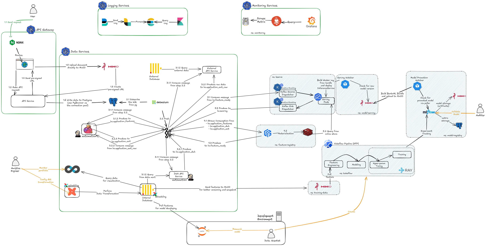

# Home Credit — Credit Risk Model Stability

[](LICENSE)
[](https://python.org)
[](https://kubernetes.io)

Production-style credit risk decisioning platform that connects loan intake, CDC, stream feature engineering, Feast/Redis materialization, and KServe scoring. The repo is a portfolio-grade MLOps prototype with documented load-test bottlenecks, not a production SLA claim.

## Results

| Metric | Value |
|--------|-------|
| **AUC (ROC)** | ~0.77 |
| **Accuracy @ threshold 0.3** | ~0.77 |
| **Features** | 24 (19 numeric + 5 categorical) |
| **Model** | XGBoost (300 trees, depth 4, lr 0.05) |
| **Dataset** | 307,511 loan applications (8.1% default rate) |
| **Latest load-test state** | 5 RPS, 1 min, 0 failures; E2E p50 2.7s, p95 3.4s (PostgreSQL insert → `hc.scoring`); 90% scoring completion within window |

AUC was chosen over accuracy due to the class imbalance (91.9% repay / 8.1% default). See [`notebook/model_evaluation.ipynb`](notebook/model_evaluation.ipynb) for ROC curves, precision-recall, calibration, and threshold tradeoff analysis. See [`MODEL_CARD.md`](MODEL_CARD.md) for full model documentation.

## Architecture



**Data flow**: Loan application → PostgreSQL → Debezium CDC → Kafka → three parallel feature streams (Flink application features, bureau consumer → Flink aggregation, DWH feature consumer) → Feast materializes all three to Redis → `hc.feature_ready` event → Knative Sequence → KServe inference → `hc.scoring` topic.

See [`docs/architecture/system-overview.md`](docs/architecture/system-overview.md) for the component table and [`docs/adr/`](docs/adr/) for the reasoning behind each technology choice.

## Quick Start (ML-only)

If you just want to explore the model and notebooks without deploying the full K8s stack:

```bash
pip install -r requirements.txt

# Step 1: generate the merged feature dataset from raw Kaggle CSVs
# (raw files: application_train.csv, bureau.csv, bureau_balance.csv,
#  previous_application.csv, POS_CASH_balance.csv, credit_card_balance.csv)
jupyter notebook notebook/08_prepare_data.ipynb

# Step 2: train and register the model
python application/training/train_register.py \
    --data data/complete_feature_dataset.csv \
    --experiment credit-risk \
    --register-name credit_risk_model

# Step 3: explore evaluation results
jupyter notebook notebook/model_evaluation.ipynb
```

## Prerequisites

**Required tools:**

| Tool | Minimum Version | Install |
|------|----------------|---------|
| Docker | 24+ | [docs.docker.com](https://docs.docker.com/get-docker/) |
| kubectl | 1.28+ | [kubernetes.io](https://kubernetes.io/docs/tasks/tools/) |
| Minikube | 1.32+ | [minikube.sigs.k8s.io](https://minikube.sigs.k8s.io/docs/start/) |
| Helm | 3+ | [helm.sh](https://helm.sh/docs/intro/install/) |
| Python | 3.10+ | [python.org](https://www.python.org/downloads/) |

**Hardware requirements:**

- **RAM**: 32 GB minimum (Minikube allocates 24 GB)
- **CPU**: 20+ cores (Minikube allocates 20)
- **Disk**: 80 GB free

**Data:** Download the [Home Credit Default Risk dataset](https://www.kaggle.com/c/home-credit-default-risk) (~3 GB) and place CSV files in `data/`.

## Local Development (no Kubernetes)

If you don't have 32 GB RAM or just want to run and modify the API locally:

```bash
# 1. Install dependencies
pip install -r requirements.txt

# 2. Copy and edit environment variables
cp .env.example .env
# Edit .env — at minimum set OPS_DB_HOST, OPS_DB_PASSWORD, KAFKA_BOOTSTRAP_SERVERS

# 3. Start required backing services (Postgres + Kafka only)
docker compose -f platform/core/docker-compose.dev.yml up -d   # if available
# or point .env at existing services

# 4. Run the API
PYTHONPATH=application uvicorn application.entrypoints.api.main:app --reload --port 8000

# 5. Run tests (no infrastructure needed — uses SQLite in-memory)
PYTHONPATH=application pytest tests/unit tests/integration -v
```

> **What you can do locally**: submit loans via the REST API, run the training script, explore all notebooks, and run the full test suite. What requires K8s: Kafka CDC pipeline, Flink jobs, Feast materialization, KServe inference.

## Full Stack Deployment

Total time: **~25-30 minutes** (first run, with image pulls). Subsequent runs are faster due to cached images.

### Phase 1 — Cluster (~5 min)

Start Minikube with the `mlops` profile and enable required addons:

```bash
make k8s-up
```

This creates a Minikube cluster with 20 CPUs, 24 GB RAM, 80 GB disk, and enables ingress, metallb, and metrics-server addons.

**Verify:**
```bash
kubectl get nodes
# NAME    STATUS   ROLES           AGE   VERSION
# mlops   Ready    control-plane   5m    v1.28.3
```

### Phase 2 — Build Application Images (~3 min)

Build Docker images directly into Minikube's Docker daemon (no registry push needed):

```bash
make build-api          # API service image
make build-consumers    # Bureau + feature consumer image
make build-frontend     # Streamlit dashboard image
```

> **Note:** `build-flink` and `build-dbt` are called automatically by later targets. `build-feast-repo` pushes to Docker Hub — run it only if you've modified the Feast code.

### Phase 3 — Core Data Platform (~8 min)

Deploy PostgreSQL, Kafka, ClickHouse, MinIO, Debezium CDC, API Gateway, and PgBouncer:

```bash
make k8s-core
make k8s-kafka-topics
```

`k8s-core` waits for Kafka to be ready before deploying downstream services. If it times out (Kafka image pull can take ~3 min on first run), re-run it — it's idempotent.

**Verify:**
```bash
kubectl get pods -n data-services
# ops-postgres-0         1/1     Running
# ops-pgbouncer-...      1/1     Running
# kafka-broker-0         1/1     Running
# clickhouse-server-0    1/1     Running
# debezium-connect-...   1/1     Running
# schema-registry-...    1/1     Running

kubectl get pods -n api-gateway
# api-service-...        1/1     Running   (2 replicas)
# frontend-service-...   1/1     Running
```

### Phase 4 — Stream Processing (~5 min)

Deploy Flink cluster and query services (bureau + feature consumers):

```bash
make k8s-streaming
```

This builds the PyFlink image, deploys JobManager + TaskManager, submits Flink CDC and bureau aggregation ETL jobs, and deploys 4 replicas each of bureau-consumer and feature-consumer.

**Verify:**
```bash
kubectl get pods -n data-services -l app=flink-jobmanager
# flink-jobmanager-...   1/1     Running

kubectl get pods -n data-services -l app=bureau-consumer
# bureau-consumer-...    1/1     Running   (4 replicas)
```

### Phase 5 — Data Warehouse Load (~1 min)

Load CSV data into ClickHouse and run dbt transforms:

```bash
make k8s-load-dwh
```

This mounts the `data/` directory into Minikube, loads CSVs into ClickHouse, runs dbt gold transformations, then unmounts.

**Verify:**
```bash
kubectl exec -n data-services clickhouse-server-0 -- \
  clickhouse-client -q "SELECT count() FROM application_mart.mart_application"
# 307511
```

### Phase 6 — ML Platform (~8 min)

Deploy MLflow, Knative (Serving + Eventing + Kafka), KServe, model serving infrastructure, and Feast feature store:

```bash
make k8s-training-data-storage       # MinIO for training snapshots (~1s)
make k8s-export-training-snapshot    # Export data from ClickHouse (~30s)
make k8s-model-registry              # MLflow + Postgres + MinIO (~1s)
make k8s-knative-complete            # KServe + Knative + watchers (~4 min)
make k8s-model-serving               # Bundle storage + serving watcher (~1s)
make k8s-mlflow-watcher              # Auto-trigger Bento builds on model promotion (~10s)
make k8s-feature-registry            # Feast + Redis online store (~2 min)
```

> **Important:** Deploy `k8s-model-serving` **before** `k8s-feature-registry`. The Feast stream processor connects to `serving-minio.model-serving.svc.cluster.local` for its registry. If model-serving isn't deployed first, Feast pods will CrashLoopBackOff until the MinIO endpoint becomes available (they recover automatically).

**Verify:**
```bash
kubectl get pods -n feature-registry
# feast-redis-...    1/1     Running
# feast-stream-...   1/1     Running   (4 replicas)

kubectl get pods -n model-registry
# mlflow-...           1/1     Running
# mlflow-postgresql-0  1/1     Running
# mlflow-watcher-...   1/1     Running

kubectl get pods -n model-serving
# serving-minio-...           1/1     Running
# serving-minio-console-...   1/1     Running
# serving-watcher-...         2/2     Running

kubectl get pods -n kserve
# kserve-controller-manager-...   2/2     Running

kubectl get pods -n knative-serving
# activator-...              1/1     Running
# autoscaler-...             1/1     Running
# controller-...             1/1     Running
# net-kourier-controller-... 1/1     Running

kubectl get pods -n knative-eventing
# eventing-controller-...    1/1     Running
# kafka-controller-...       1/1     Running
# kafka-sink-receiver-...    1/1     Running

kubectl get pods -n training-data
# training-minio-...           1/1     Running
# training-minio-console-...   1/1     Running
```

### Phase 7 — Training Infrastructure (~2 min)

Deploy Kubeflow Pipelines (workflow orchestration) and Ray (distributed hyperparameter tuning):

```bash
make k8s-kubeflow      # Kubeflow Pipelines v2.14.3 (~15s)
make k8s-ray           # Ray cluster (1 head + 2 workers, ~15s)
```

Kubeflow pulls ~15 container images on first run. Pods may take 1-2 minutes to become Ready.

**Verify:**
```bash
kubectl get pods -n kubeflow -l app=ml-pipeline
# ml-pipeline-...   1/1     Running

kubectl get raycluster -n ray
# raycluster-k8s   2   2   3   6Gi   ready

kubectl get pods -n ray
# kuberay-operator-...                1/1     Running
# raycluster-k8s-head-...             1/1     Running
# raycluster-k8s-workers-worker-...   1/1     Running   (2 replicas)
```

### Phase 8 — Observability (optional, ~2 min)

```bash
make k8s-monitoring    # Prometheus + Grafana
make k8s-logging       # ECK (Elasticsearch + Kibana + Filebeat)
```

> **Note:** Elasticsearch and Kibana require significant memory. On resource-constrained setups, these pods may stay Pending. The core platform works without them.

**Verify:**
```bash
kubectl get pods -n monitoring
# kube-prometheus-stack-grafana-...              3/3     Running
# kube-prometheus-stack-operator-...             1/1     Running
# prometheus-kube-prometheus-stack-prometheus-0  2/2     Running

kubectl get pods -n logging
# elastic-operator-0                  1/1     Running
# elasticsearch-es-default-0          1/1     Running
# elastic-stack-eck-kibana-kb-...     1/1     Running
# filebeat-beat-filebeat-...          1/1     Running
```

### Phase 9 — Port Forwards

Open separate terminals for the services you need:

```bash
make pf-clickhouse         # localhost:8123
make pf-mlflow             # localhost:5000
make pf-minio-training     # localhost:9000 (API) + localhost:9090 (Console)
make pf-kafka-ui           # localhost:8080
make pf-postgres           # localhost:6432 (via PgBouncer)
make pf-kafka              # localhost:9092
```

## Verify End-to-End

After deployment, verify the full pipeline works:

```bash
# 1. Port-forward the API
kubectl port-forward -n api-gateway svc/api-service 8000:80 &

# 2. Check health
curl http://localhost:8000/health
# {"status":"healthy","timestamp":"..."}

# 3. Submit a test loan application
curl -X POST http://localhost:8000/api/v1/applications \
  -H "Content-Type: application/json" \
  -d '{
    "sk_id_curr": "215354",
    "code_gender": "M",
    "birth_date": "1985-06-15",
    "cnt_children": 1,
    "amt_income_total": 250000,
    "amt_credit": 500000,
    "amt_annuity": 25000,
    "amt_goods_price": 450000,
    "name_contract_type": "Cash loans",
    "name_income_type": "Working",
    "name_education_type": "Higher education",
    "name_family_status": "Married",
    "name_housing_type": "House / apartment",
    "employment_start_date": "2015-03-01",
    "occupation_type": "Laborers",
    "organization_type": "Business Entity Type 3",
    "flag_mobil": 1, "flag_emp_phone": 1, "flag_work_phone": 0,
    "flag_phone": 1, "flag_email": 0,
    "flag_own_car": 1, "flag_own_realty": 1, "own_car_age": 5
  }'

# 4. Verify CDC captured the event
kubectl exec -n data-services kafka-broker-0 -- \
  kafka-console-consumer --bootstrap-server localhost:9092 \
  --topic hc.applications.public.loan_applications \
  --from-beginning --max-messages 1 --timeout-ms 10000

# 5. Check application status
curl http://localhost:8000/api/v1/applications/TEST_001/status
```

The application flows through: **API → PostgreSQL → Debezium CDC → Kafka → Flink (features) + Consumers (bureau/DWH) → Feast (Redis) → KServe scoring → Kafka output**.

## Project Structure

```
.
├── application/                  # Application code (Clean Architecture)
│   ├── core/                     #   Config (Pydantic), tracing, database
│   ├── domain/                   #   Business logic & entities
│   ├── workflows/                #   Use case orchestration
│   ├── infrastructure/           #   Adapters (DB, Kafka, ClickHouse, MinIO)
│   ├── entrypoints/              #   FastAPI API + Kafka consumers
│   ├── scoring/                  #   BentoML scoring service
│   ├── training/                 #   XGBoost training + MLflow registration
│   ├── feast_repo/               #   Feast feature definitions + stream processor
│   ├── flink/                    #   PyFlink CDC & bureau aggregation ETL
│   └── frontend/                 #   Streamlit dashboard
├── platform/                     # Infrastructure-as-Code (K8s manifests)
│   ├── core/k8s/                 #   API, PostgreSQL, PgBouncer, Ingress
│   ├── data/k8s/                 #   Kafka, ClickHouse, Flink, CDC, MinIO
│   ├── ml/k8s/                   #   KServe, MLflow, Kubeflow, Feast, Ray
│   └── ops/k8s/                  #   Prometheus, Grafana, ECK
├── tests/                        # Unit, integration, and load-test coverage
│   ├── unit/                     #   Unit tests
│   ├── integration/              #   Integration tests (in-memory SQLite)
│   └── test_load/                #   Locust load tests
├── notebook/                     # Jupyter notebooks (EDA, modeling, evaluation)
├── ml_data_mart/                 # dbt models for ClickHouse
├── docs/adr/                     # Architecture Decision Records
├── Makefile                      # Orchestration targets
├── MODEL_CARD.md                 # Model documentation
└── LICENSE                       # MIT License
```

## System Architecture

**Data flow**: Postgres → Debezium/Kafka → Flink → Redis/ClickHouse → KServe/BentoML → Kafka

- **Data platform**: PostgreSQL (operational DB) + Debezium (CDC) → Kafka → Flink → ClickHouse (DWH) + Redis (online store)
- **ML platform**: Kubeflow/Ray (training) → MLflow (registry) → BentoML (bundling) → KServe (serving)
- **Feature store**: Feast with offline (ClickHouse) and online (Redis) stores, Flink materialization
- **Observability**: Prometheus + Grafana (metrics), ECK — Elasticsearch + Kibana + Filebeat (logs)
- **Model deployment pipeline**: MLflow watcher detects promotion → builds Bento bundle → serving watcher deploys KServe InferenceService

See [`docs/adr/`](docs/adr/) for detailed architecture decisions behind each component.

## Testing

```bash
# Run unit and integration tests
PYTHONPATH=application pytest tests/ --ignore=tests/test_load -v

# Load test (requires running infrastructure)
locust -f tests/test_load/locustfile_e2e_prediction.py --web-host=0.0.0.0 --web-port=8089
```

CI runs 6 coverage gates: domain (90%), schemas (90%), scoring (60%), infra adapters (80%), consumers (45%), integration (60%).

## Performance Optimization Log

Load testing drove several architectural improvements, but the latest measured cycle is not yet at the target SLA. The current bottleneck is non-CPU delivery through the Knative Sequence KafkaChannel into KServe; see `tests/test_load/RESULTS.md` for the evidence trail.

### Iteration 1 — Baseline
- **Result**: 120–130 RPS, p95 latency ~7 min
- **Root cause**: Serialized Feast lookups in serving pod — each thread blocked up to 4.5s retrying feature availability
- **Fix**: Replaced polling with Kafka event-driven pattern (`hc.feature_ready` topic) to enable parallel processing

### Iteration 2 — Post-Kafka Refactor
- **Result**: 80–120 RPS, p95 improved by ~100s
- **Root cause**: (1) XGBoost using all CPU cores per prediction, causing context-switch overhead; (2) Redis write throughput saturated during Feast materialization
- **Fix**: Configured inference thread count; horizontal Redis scaling

### Iteration 3 — Micro-batch + Resource Tuning
- **Result**: earlier tuning reached higher insert throughput, but latest validated cycle measured 29.43 insert RPS and only 17.5% scoring completion inside the 3-minute window
- **Improvements**: Micro-batch Redis ingestion (200 records or 300ms window), tuned worker/thread/pod counts and resource limits
- **Remaining**: fix Knative Sequence/KServe delivery, add DLQ visibility, then rerun a clean cycle

## Troubleshooting

### Kafka image pull timeout on first run
`make k8s-core` may fail with timeout waiting for `kafka-broker-0`. The Confluent Kafka image (~1 GB) takes ~3 min to pull. **Fix**: Wait for `kubectl rollout status statefulset/kafka-broker -n data-services`, then re-run `make k8s-core`.

### Feast pods CrashLoopBackOff
Feast stream processor needs `serving-minio.model-serving.svc.cluster.local:9000`. If `k8s-model-serving` wasn't deployed first, Feast pods crash with `EndpointConnectionError`. **Fix**: Run `make k8s-model-serving`, then wait — pods recover automatically via CrashLoopBackOff retry.

### Elasticsearch/Prometheus stuck in Pending
These are resource-intensive. On smaller machines, they may not schedule. **Fix**: Skip `make k8s-logging` and `make k8s-monitoring` — the core platform works without them.

### API pods ImagePullBackOff
Images like `ngnquanq/credit-risk-api:latest` must be built into Minikube's Docker, not pulled from Docker Hub. **Fix**: Run `make build-api`, `make build-consumers`, `make build-frontend` before `make k8s-core`.

### Minikube IP change after restart
If Minikube IP changes between sessions, some services may fail to connect. **Fix**: `minikube -p mlops stop && make k8s-up`.

### Starting fresh
To wipe everything and start over:
```bash
minikube delete -p mlops
make k8s-up
```

## Operations

- **Restart after Minikube IP change**: `minikube -p mlops stop && make k8s-up`
- **Clean start**: `minikube delete -p mlops` then `make k8s-up`
- **Rebuild serving after model promotion**: Ensure mlflow-watcher and serving-watcher are running
- **Feature backfill**: Check Feast repo for materialization job definitions

## Dataset

[Home Credit Default Risk](https://www.kaggle.com/c/home-credit-default-risk) (Kaggle, ~3 GB). External bureau + internal loan history data. See `notebook/` for EDA.

## Notebooks

| Notebook | Description |
|----------|-------------|
| `model_evaluation.ipynb` | ROC, PR curve, confusion matrix, calibration, threshold tradeoff |
| `feature_importance.ipynb` | XGBoost importance, SHAP summary + dependence plots |
| `01_baseline_modeling.ipynb` | Initial baseline model (Decision Tree) |
| `02_aggregated_modeling.ipynb` | Aggregation-based feature validation |
| `03_full_feature_modeling.ipynb` | Full 24-feature XGBoost + CatBoost comparison |
| `04–07_eda_*.ipynb` | Exploratory data analysis per data source |
| `08_prepare_data.ipynb` | Feature engineering pipeline |

## Future Development

1. Migrate to managed K8s (EKS/GKE/AKS) for higher availability and auto-scaling
2. Add business rule engine alongside ML scoring
3. Authentication/authorization security layer
4. Production dashboards (Kibana, Grafana)
5. ClickHouse read replicas to separate read/write workloads
6. Optimize Kafka consumers (multi-threaded) and serving pod fan-out
7. OCR/text extraction from uploaded documents (payslips, IDs) for additional features

## Reference

- [Building async ML Inference Pipelines with Knative Eventing and KServe](https://medium.com/cars24-data-science-blog/building-asynchronous-ml-inference-pipelines-with-knative-eventing-and-kserve-79a7ab80bc79)

## Assumptions

- **Processing time target**: Within 1 day from application submission (many institutions take longer due to partial manual review — this system is 100% automated)

## License

This project is licensed under the MIT License — see [LICENSE](LICENSE) for details.
