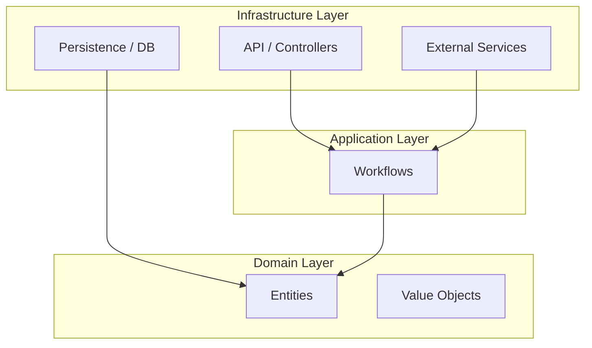

# Clean Architecture Migration Guide

## Current State vs. Goal

The current application structure is **Layered** (API -> Services -> DB), which is common but couples the business logic to frameworks like FastAPI and SQLAlchemy.

To answer your request: **"is this follow clean architecture best practice?"**
**Answer: No.** The current structure mixes "Driver" concerns (HTTP handling) with "Domain" concerns (Loan evaluation logic).

## The New Structure

We are introducing a **Clean Architecture** structure to center the application around the **Domain**.

## Directory Map

### 1. `application/domain/` (The Core)
**Dependencies:** None. Pure Python.
- **Purpose**: Defines the "Business Truths".
- **Example**: `LoanApplication` entity containing the `evaluate_worthiness` logic.
- **Your Request**: "evaluate whether the people are worth it" -> This logic belongs here.

### 2. `application/workflows/` (The Application Logic)
**Dependencies**: Domain.
- **Purpose**: Orchestrates the flow of data.
- **Example**: `AssessLoanRisk` class that fetches data, calls the ML model, and updates the Domain Entity.

### 3. `application/infrastructure/` (The Adapters)
**Dependencies**: Workflows, Domain.
- **Purpose**: talk to the outside world (Database, API, ML Model Serving).
- **Migration**:
    - `api/` -> `infrastructure/api/`
    - `services/` -> `infrastructure/external/`
    - `db_models/` -> `infrastructure/persistence/`

## Next Steps

1. Move the business logic from `api/main.py` (e.g., `create_loan_application`) into a Workflow.
2. Refactor `api/main.py` to simply call that Workflow.
