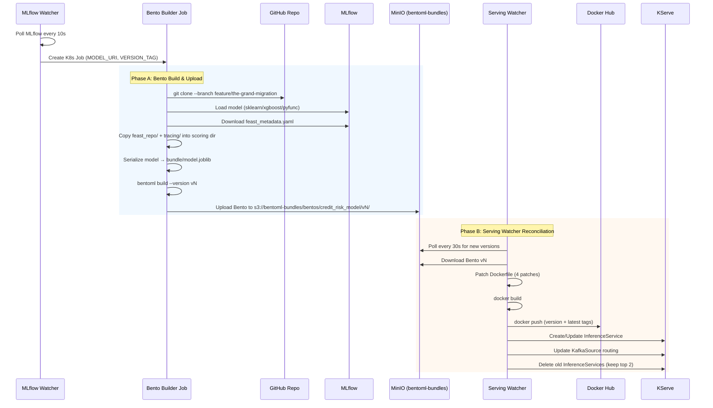

# Model Bundling Pipeline: MinIO-Based Artifact Lifecycle

This document describes the step-by-step process of building BentoML bundles and deploying them as KServe InferenceServices through MinIO object storage. For the broader 7-phase model lifecycle (training through production scoring), see [ADR-0009](../adr/0009-model-training-and-promotion-pipeline.md).

## Overview

When a model is promoted to `Production` in MLflow, two independent services — the **Bento Builder** and the **Serving Watcher** — coordinate through MinIO to transform the model into a running KServe InferenceService. MinIO acts as the handoff point: the Builder uploads self-contained Bento bundles, and the Watcher picks them up, containerizes them, and deploys them.



## MinIO Bucket Layout

Both the Builder and Watcher use the same MinIO instance (`serving-minio.model-serving.svc.cluster.local:9000`) and bucket (`bentoml-bundles`). Each model version is stored as a complete directory tree:

```
s3://bentoml-bundles/
└── bentos/
    └── credit_risk_model/
        ├── v10/
        ├── v11/
        └── v12/                          # Latest version
            ├── bento.yaml                # Bento metadata (name, version, service entry point)
            ├── src/                      # Application code (from bentofile.yaml includes)
            │   ├── service.py            # BentoML scoring service
            │   ├── config.py             # Pydantic settings
            │   ├── pipeline.py           # Pre/post-processing logic
            │   ├── model_registry.py     # Model loading utilities
            │   ├── schemas.py            # Request/response schemas
            │   ├── bentofile.yaml        # Build spec (copied into bundle)
            │   ├── bundle/
            │   │   ├── model.joblib      # Serialized sklearn pipeline (preprocessor + XGBoost)
            │   │   └── feast_metadata.yaml  # Feature name mapping (Feast → model columns)
            │   ├── feast_repo/           # Physical copy of application/feast_repo/
            │   │   ├── feature_store.yaml
            │   │   ├── feature_views.py
            │   │   └── ...
            │   └── tracing/              # Physical copy of application/tracing/
            ├── env/
            │   ├── docker/
            │   │   └── Dockerfile        # BentoML-generated Dockerfile
            │   └── python/
            │       └── requirements.txt  # Resolved Python dependencies
            └── apis/                     # BentoML API definitions
```

Key artifacts:
- **`src/bundle/model.joblib`** — the serialized sklearn Pipeline containing both the preprocessor (ColumnTransformer) and the XGBoost classifier. This is what gets loaded at runtime via `SCORING_MODEL_PATH=bundle/model.joblib`.
- **`src/bundle/feast_metadata.yaml`** — maps lowercase Feast feature names to uppercase model column names. Downloaded from the MLflow run that produced the model. If missing, the scoring service falls back to `feature_registry.py`.
- **`src/feast_repo/`** — physical copy (not symlink) of the Feast feature definitions. Required because BentoML's `include` directive does not follow symlinks during build.

## Phase A: Bento Build & Upload

**Trigger:** MLflow Watcher detects a new `Production` version and creates a K8s Job in the `kserve` namespace.

**Container:** `python:3.11-slim`, one-shot Job with `ttlSecondsAfterFinished: 1800`

**Source of truth:** The deployed script lives in ConfigMap `bento-builder-script` (`platform/ml/k8s/kserve/bento-builder/configmap.yaml`), not the standalone `build_and_upload.py` — the ConfigMap version includes additional logic for Feast repo copying and feast_metadata download.

### Step-by-step

**Step 1 — Install build dependencies**

```bash
pip install --no-cache-dir mlflow==2.14.3 bentoml boto3 gitpython cloudpickle \
    pyyaml pandas==2.2.2 scikit-learn==1.5.1 xgboost==2.1.0 numpy==1.26.4
```

Pinned versions match the training environment to ensure the deserialized model is compatible.

**Step 2 — Resolve source code**

Two options, checked in order:
1. **Local mount** (`APP_LOCAL_PATH`): If `/repo-src` exists (hostPath mount), copy it to a temp directory. Used in development.
2. **Git clone**: `git clone --depth 1 --branch feature/the-grand-migration <APP_REPO>`. Used in production.

The branch is configured via `APP_REF` in the builder job template (`platform/ml/k8s/mlflow-watcher/builder-configmap.yaml:34`).

**Step 3 — Copy Feast repo and tracing module**

BentoML's `include` directive does not follow symlinks. Since `application/scoring/feast_repo` and `application/scoring/tracing` may be symlinks, the builder physically copies them:

```
application/feast_repo/  →  application/scoring/feast_repo/
application/tracing/     →  application/scoring/tracing/
```

Existing symlinks or directories at the destination are removed first to ensure a clean copy.

**Step 4 — Load model from MLflow**

Uses a fallback chain to handle different model serialization flavors:

```python
try:
    mdl = mlflow.sklearn.load_model(model_uri)    # Preferred: full sklearn Pipeline
except:
    try:
        mdl = mlflow.xgboost.load_model(model_uri)  # Fallback: raw XGBoost Booster
    except:
        mdl = mlflow.pyfunc.load_model(model_uri)    # Last resort: generic pyfunc wrapper
```

The `model_uri` is typically `models:/credit_risk_model/12` (specific version) injected by the MLflow Watcher.

**Step 5 — Serialize model to joblib**

```python
joblib.dump(mdl, "application/scoring/bundle/model.joblib")
```

The `bundle/` directory is created if it doesn't exist. This file becomes the model artifact inside the Bento.

**Step 6 — Download feast_metadata.yaml**

The builder extracts the MLflow run ID from the model URI, then downloads `feast_metadata.yaml` from that run's artifacts:

```python
client = mlflow.tracking.MlflowClient()
metadata_tmp = client.download_artifacts(run_id, "feast_metadata.yaml", work_dir)
shutil.copy(metadata_tmp, "application/scoring/bundle/feast_metadata.yaml")
```

This file is logged during training (`train_register.py`) and contains:
- Feature names selected for the model
- Column name mappings (Feast lowercase → model uppercase)
- Categorical/numerical feature split

If the download fails, the scoring service falls back to discovering features from the Feast registry at startup.

**Step 7 — Build the Bento**

```bash
cd application/scoring
bentoml build --version v12
```

BentoML reads `bentofile.yaml`, packages all included files (`**`, `feast_repo/**`, `tracing/**`), resolves Python dependencies, generates a Dockerfile, and writes the complete bundle to `~/.bentoml/bentos/credit_risk_scoring/v12/`.

**Step 8 — Upload to MinIO**

The builder walks the entire Bento directory and uploads every file:

```python
s3 = boto3.session.Session().resource("s3", endpoint_url=endpoint)
bucket = s3.Bucket("bentoml-bundles")
for root, _, files in os.walk(bento_path):
    for fn in files:
        rel = os.path.relpath(os.path.join(root, fn), bento_path)
        bucket.upload_file(fn, f"bentos/credit_risk_model/v12/{rel}")
```

Final storage URI: `s3://bentoml-bundles/bentos/credit_risk_model/v12/`

## Phase B: Serving Watcher Reconciliation

**Trigger:** Continuous polling loop (every 30 seconds).

**Container:** `docker:27-dind` with a privileged Docker daemon sidecar. The watcher installs Python + dependencies at pod startup (`apk add python3 py3-pip && pip3 install kubernetes pyyaml boto3`).

**Source of truth:** `platform/ml/k8s/kserve/serving-watcher/watcher.py`, mounted via ConfigMap `serving-watcher`.

### Step-by-step

**Step 1 — Poll MinIO for versions**

```python
s3.list_objects_v2(Bucket="bentoml-bundles", Prefix="bentos/credit_risk_model/", Delimiter="/")
```

Extracts version strings from `CommonPrefixes` (e.g., `v10`, `v11`, `v12`), filters for `v`-prefixed entries, and sorts descending by numeric value. Result: `[v12, v11, v10, ...]`.

**Step 2 — Select target versions**

Picks the top `MAX_ACTIVE_MODELS=2` versions. These are the versions that should have active InferenceServices. Everything else gets cleaned up.

**Step 3 — For each new version: download, patch, build, push**

**(a) Download Bento from MinIO**

Uses paginated `list_objects_v2` + `download_file` to reconstruct the entire Bento directory tree in a temp directory.

**(b) Patch the Dockerfile** (see [Dockerfile Patching](#dockerfile-patching-deep-dive) below)

**(c) Build Docker image**

```bash
docker build --no-cache \
  -t docker.io/ngnquanq/credit-risk-scoring:v12 \
  -t docker.io/ngnquanq/credit-risk-scoring:latest \
  -f {bento_dir}/env/docker/Dockerfile {bento_dir}
```

Both a version-specific tag and `latest` are applied.

**(d) Push to Docker Hub**

```bash
docker push docker.io/ngnquanq/credit-risk-scoring:v12
docker push docker.io/ngnquanq/credit-risk-scoring:latest
```

Credentials come from optional Secret `dockerhub-creds` in the `model-serving` namespace.

**Step 4 — Create/Update KServe InferenceService**

Loads `isvc-template-serverless.yaml` and substitutes:

| Variable | Example Value |
|----------|---------------|
| `${SERVICE_NAME}` | `credit-risk-v12` |
| `${NAMESPACE}` | `kserve` |
| `${VERSION}` | `v12` |
| `${IMAGE_URI}` | `docker.io/ngnquanq/credit-risk-scoring:latest` |

Creates or updates the InferenceService via the Kubernetes CustomObjects API. Key runtime configuration:
- `SCORING_MODEL_SOURCE=local`, `SCORING_MODEL_PATH=bundle/model.joblib`
- Feast enabled with Redis at `feast-redis.feature-registry:6379`
- Feast registry at `s3://feast-registry/feature_repo/registry.db` (also on MinIO)
- Knative autoscaling: min 1, max 10 replicas, concurrency target 100

**Step 5 — Update KafkaSource routing**

Creates or patches `feature-ready-source` KafkaSource to route `hc.feature_ready` events to the latest InferenceService at `/v1/score-by-id`:

```yaml
sink:
  ref:
    apiVersion: serving.kserve.io/v1beta1
    kind: InferenceService
    name: credit-risk-v12
  uri: /v1/score-by-id
delivery:
  retry: 3
  backoffPolicy: exponential
  deadLetterSink: scoring-dlq-sink
```

**Step 6 — Cleanup old versions**

Deletes InferenceServices for versions no longer in the top-N target set. The in-memory `deployed_versions` set tracks what's currently deployed.

Note: if the watcher pod restarts, `deployed_versions` resets to empty, causing it to re-deploy all top-N versions. This is safe because all create/update operations are idempotent.

## Dockerfile Patching Deep Dive

BentoML generates a Dockerfile during `bentoml build`, but the generated Dockerfile has assumptions that break in the Docker-in-Docker build context. The Serving Watcher applies four patches before building:

### Patch 1: Resolve `$BENTO_PATH`

**Problem:** BentoML generates `COPY $BENTO_PATH /home/bentoml/bento` but `$BENTO_PATH` is a build-time variable that isn't set in the DinD context.

**Fix:** String replacement `$BENTO_PATH` → `/home/bentoml/bento`

### Patch 2: Replace `uv` with `pip`

**Problem:** BentoML defaults to using `uv` (a fast Python package installer) for dependency installation, but `uv` may not be available in all base images.

**Fix:** Replace `uv --directory $INSTALL_ROOT pip install -r` → `pip install --no-cache-dir -r`

### Patch 3: Strip protobuf from requirements.txt

**Problem:** `bentofile.yaml` specifies `protobuf>=4.25.0,<5.0`, but Feast 0.40+ requires `protobuf.runtime_version` which only exists in protobuf 5.x. Including the `<5.0` constraint in requirements.txt causes pip resolution failures when combined with the force-install in Patch 4.

**Fix:** Remove any line starting with `protobuf` from `env/python/requirements.txt`.

### Patch 4: Force-install protobuf 5.29.0

**Problem:** After the main `pip install`, protobuf 4.x is installed (satisfying opentelemetry-proto's constraint). But Feast needs protobuf 5.x for `runtime_version`.

**Fix:** Insert `RUN pip install --force-reinstall --no-deps protobuf==5.29.0` before the `USER bentoml` line in the Dockerfile. The `--no-deps` flag bypasses opentelemetry-proto's `protobuf<5.0` constraint. This gives Feast the API it needs while leaving opentelemetry functional (it works at runtime with protobuf 5.x despite the pip constraint).

### Fallback: Generate requirements.txt

If `env/python/requirements.txt` doesn't exist (can happen with certain BentoML versions), the watcher reads `src/bentofile.yaml` and generates a requirements.txt from the `python.packages` list.

## Environment Variables Reference

### Bento Builder Job

Configured in `platform/ml/k8s/mlflow-watcher/builder-configmap.yaml` (job template).

| Variable | Default | Description |
|----------|---------|-------------|
| `MLFLOW_TRACKING_URI` | `http://mlflow.model-registry.svc.cluster.local:80` | MLflow server URL |
| `MODEL_NAME` | `credit_risk_model` | Model name in MLflow registry (also used in MinIO path) |
| `MODEL_URI` | *(set by poller)* | MLflow model URI, e.g. `models:/credit_risk_model/12` |
| `VERSION_TAG` | *(set by poller)* | Bento version tag, e.g. `v12` |
| `APP_REPO` | `https://github.com/ngnquanq/credit-risk-ml-system.git` | Git repository URL |
| `APP_REF` | `feature/the-grand-migration` | Git branch to clone |
| `APP_LOCAL_PATH` | *(unset)* | Optional: local repo mount path (skips git clone) |
| `APP_SUBPATH` | `application/scoring` | Scoring service directory relative to repo root |
| `BENTO_BUCKET` | `bentoml-bundles` | MinIO bucket for Bento storage |
| `BENTO_PREFIX` | `bentos` | Key prefix within bucket |
| `AWS_S3_ENDPOINT` | `http://serving-minio.model-serving.svc.cluster.local:9000` | MinIO endpoint |
| `AWS_ACCESS_KEY_ID` | `minio_user` | MinIO access key |
| `AWS_SECRET_ACCESS_KEY` | `minio_password` | MinIO secret key |
| `AWS_REGION` | `us-east-1` | S3 region (required by boto3) |

### Serving Watcher

Configured in `platform/ml/k8s/model-serving/watcher-deployment.yaml`.

| Variable | Default | Description |
|----------|---------|-------------|
| `MINIO_ENDPOINT` | `http://serving-minio.model-serving.svc.cluster.local:9000` | MinIO endpoint |
| `MINIO_ACCESS_KEY` | `minio_user` | MinIO access key |
| `MINIO_SECRET_KEY` | `minio_password` | MinIO secret key |
| `BUCKET_NAME` | `bentoml-bundles` | MinIO bucket to poll |
| `BENTO_PREFIX` | `bentos/credit_risk_model` | Full prefix to list versions under |
| `REGISTRY_URL` | `docker.io/ngnquanq` | Docker registry URL |
| `IMAGE_NAME` | `credit-risk-scoring` | Docker image name |
| `DOCKER_USERNAME` | *(from Secret)* | Docker Hub username (optional) |
| `DOCKER_PASSWORD` | *(from Secret)* | Docker Hub password (optional) |
| `POLL_INTERVAL_SECS` | `30` | Seconds between MinIO polls |
| `MAX_ACTIVE_MODELS` | `2` | Max InferenceServices to keep active |
| `KSERVE_NAMESPACE` | `kserve` | Namespace for InferenceServices |
| `DOCKER_HOST` | `tcp://localhost:2375` | DinD daemon address |

## Troubleshooting

### Builder Job fails

```bash
kubectl get jobs -n kserve -l app=bento-builder
kubectl logs job/bento-build-xxxxx -n kserve
```

Common causes:
- **MLflow unreachable**: Check `MLFLOW_TRACKING_URI` and that MLflow is running in `model-registry` namespace
- **Git clone fails**: Verify `APP_REPO` URL and `APP_REF` branch exist. Check network policies
- **Model load fails**: The model flavor may not match. Check MLflow UI for the model's logged flavor
- **MinIO upload fails**: Verify bucket `bentoml-bundles` exists and credentials are correct

### Serving Watcher not detecting new versions

```bash
kubectl logs deployment/serving-watcher -n model-serving -c watcher
```

Common causes:
- **Bucket prefix mismatch**: Builder uses `BENTO_PREFIX=bentos` + `MODEL_NAME=credit_risk_model` → `bentos/credit_risk_model/vN`. Watcher uses `BENTO_PREFIX=bentos/credit_risk_model` → lists `bentos/credit_risk_model/vN`. Ensure these align
- **MinIO endpoint differs**: Both must point to `serving-minio.model-serving:9000`

### Docker build fails

```bash
kubectl logs deployment/serving-watcher -n model-serving -c watcher | grep -A5 "Build exit code"
```

Common causes:
- **Dockerfile not found**: The Bento may be incomplete in MinIO. Re-run the builder job
- **Protobuf conflict**: The patching logic may need updating if dependency versions change. Check `requirements.txt` contents after patching
- **Missing requirements.txt**: The watcher has a fallback that generates it from `bentofile.yaml`, but check logs for "requirements.txt not found"

### InferenceService not starting

```bash
kubectl get isvc -n kserve
kubectl describe isvc credit-risk-v12 -n kserve
kubectl logs -l serving.kserve.io/inferenceservice=credit-risk-v12 -n kserve
```

Common causes:
- **Model file missing**: Verify `bundle/model.joblib` exists in the Docker image
- **Feast connectivity**: Check that `feast-redis.feature-registry:6379` is reachable from `kserve` namespace
- **Feast registry**: Verify `s3://feast-registry/feature_repo/registry.db` exists on MinIO
- **Health check fails**: The scoring service exposes `/healthz` on port 3000. Check startup logs for model loading errors
