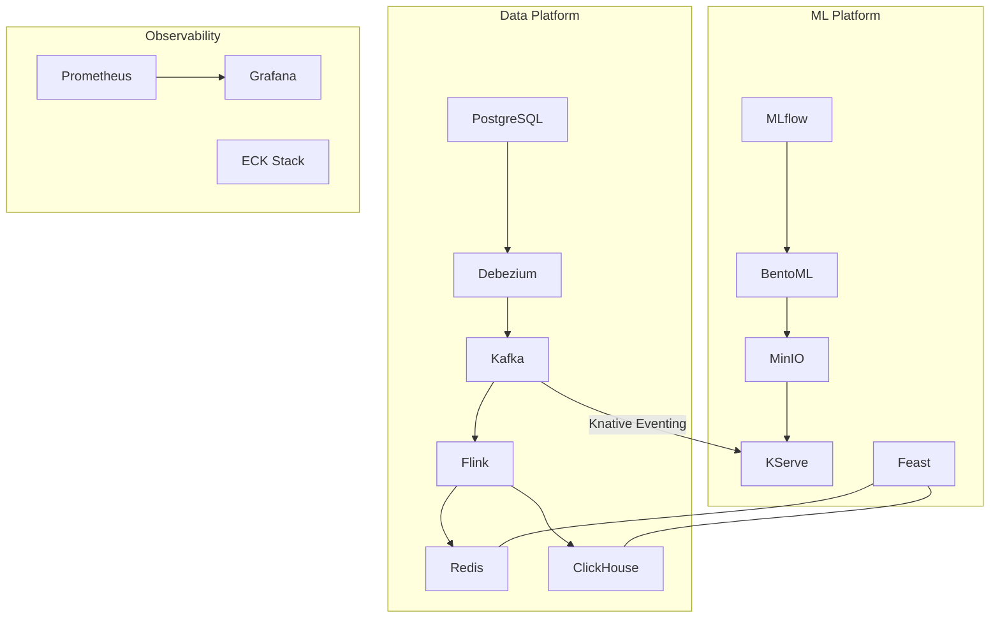

# System Architecture

## Data Flow

```
Loan App → PostgreSQL → Debezium (CDC) → Kafka
  → Flink → Redis (online features) + ClickHouse (DWH)
  → Kafka (feature_ready) → KServe → Kafka (scoring results)
```

## Architecture Diagram



## Components

| Component | Technology | ADR |
|-----------|-----------|-----|
| Operational DB | PostgreSQL | — |
| CDC | Debezium | [ADR-0002](../adr/0002-event-driven-architecture-with-kafka.md) |
| Event Streaming | Kafka | [ADR-0002](../adr/0002-event-driven-architecture-with-kafka.md) |
| Stream Processing | Flink | [ADR-0007](../adr/0007-flink-for-stream-processing.md) |
| Data Warehouse | ClickHouse | [ADR-0001](../adr/0001-use-clickhouse-as-data-warehouse.md) |
| Feature Store | Feast | [ADR-0003](../adr/0003-feast-as-feature-store.md) |
| Model Serving | KServe + BentoML | [ADR-0004](../adr/0004-kserve-and-bentoml-for-model-serving.md) |
| Model Registry | MLflow | — |
| Training | Kubeflow + Ray | — |
| Observability | Prometheus + Grafana + ECK | — |
| Infrastructure | Kubernetes | [ADR-0005](../adr/0005-migrate-to-kubernetes.md) |
| App Architecture | Clean Architecture | [ADR-0006](../adr/0006-clean-architecture-for-application-layer.md) |
